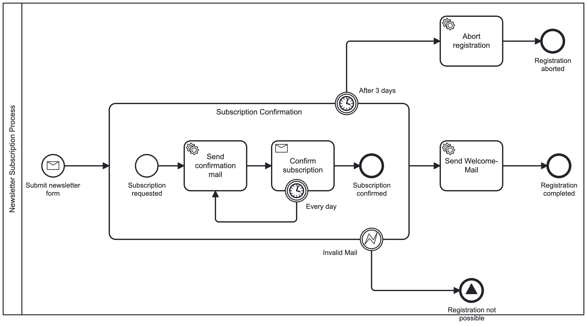

# CIB Seven Developer Training Exercises

Practical exercises for the CIB Seven developer training. The project implements a newsletter subscription workflow using CIB Seven as the process engine, the Process Engine API as an engine-neutral abstraction layer, and a hexagonal architecture to keep business logic decoupled from infrastructure.

---

## Repository Structure

```
cibseven-developer-training-exercises/
├── src/
│   ├── main/
│   │   ├── kotlin/io/miragon/training/
│   │   │   ├── adapter/
│   │   │   │   ├── inbound/
│   │   │   │   │   ├── cib7/       # Service task workers (Process Engine Worker)
│   │   │   │   │   └── rest/       # REST controllers
│   │   │   │   ├── outbound/
│   │   │   │   │   ├── cib7/       # Process engine adapter (start/correlate)
│   │   │   │   │   └── db/         # JPA persistence adapter
│   │   │   │   └── process/        # Generated BPMN process API constants
│   │   │   ├── application/
│   │   │   │   ├── port/
│   │   │   │   │   ├── inbound/    # Use case interfaces
│   │   │   │   │   └── outbound/   # Repository and process port interfaces
│   │   │   │   └── service/        # Use case implementations
│   │   │   └── domain/             # Domain model (pure Kotlin, no framework deps)
│   │   └── resources/
│   │       ├── application.yaml
│   │       └── bpmn/
│   │           └── newsletter.bpmn
│   └── test/
│       └── kotlin/io/miragon/training/
│           ├── KonsistArchitectureTest.kt
│           └── konsist/            # Architecture rule helpers (Konsist)
├── stack/
│   ├── docker-compose.yml          # PostgreSQL for local development
│   └── init-schemas.sql
├── build.gradle.kts
├── gradle/libs.versions.toml
└── settings.gradle.kts
```

---

## Technical Stack

| Component | Technology |
|---|---|
| Language | Kotlin 2.3 |
| Framework | Spring Boot 3.5 |
| Process Engine | CIB Seven 2.1 |
| Process Engine API | bpm-crafters process-engine-api 1.4 |
| Database | PostgreSQL (JPA / Hibernate) |
| Build | Gradle 9.2 with version catalog |
| Architecture tests | Konsist |

---

## CIB Seven

[CIB Seven](https://cibseven.org) is a community-maintained distribution of Camunda Platform 7. It provides full compatibility with the Camunda 7 API while being independently maintained and open-source.

In this project CIB Seven runs embedded inside Spring Boot, exposes the Camunda web application at `http://localhost:8080/camunda`, and handles BPMN process execution for the newsletter subscription workflow.

---

## Process Engine API

[Process Engine API](https://github.com/bpm-crafters/process-engine-api) is an engine-neutral abstraction layer for BPMN process engines — similar in spirit to how JPA abstracts databases or Spring Cloud Stream abstracts messaging systems.

Key benefits:
- **Engine neutrality** — write your integration code once; swap between CIB Seven, Camunda 7, Camunda 8, or Operaton by changing configuration and dependencies, not business logic
- **Adapter pattern** — each supported engine has its own adapter; this project uses the CIB Seven embedded adapter
- **No engine lock-in** — the domain and application layers have zero knowledge of which engine is running underneath

### Process Engine Worker

Service tasks are handled using the [Process Engine Worker](https://github.com/bpm-crafters/process-engine-worker) library. It provides a `@ProcessEngineWorker` annotation that registers a method as a task handler for a given topic — no `JavaDelegate` coupling, no engine-specific interfaces in your business code.

```kotlin
@ProcessEngineWorker(topic = TaskTypes.SEND_WELCOME_MAIL)
fun sendWelcomeMail(@Variable subscriptionId: String): Map<String, Any> {
    useCase.sendWelcomeMail(SubscriptionId(UUID.fromString(subscriptionId)))
    return emptyMap()
}
```

Workers are delivered via embedded scheduled polling (configurable interval, default 5 seconds).

---

## Architecture

The project follows a **hexagonal architecture** (ports & adapters):

```
REST / CIB7 Workers          Application              CIB7 / Database
  (inbound adapters)   →   ports + services   →     (outbound adapters)
                               ↑
                            Domain
                        (engine-neutral)
```

Architecture rules are enforced at build time via [Konsist](https://github.com/LemonAppDev/konsist) tests (see `KonsistArchitectureTest`).

---

## Exercises

### Background: Miravelo

**Miravelo** is a company that sells bikes — gravel bikes, road bikes, and more. As the business grows, Miravelo increasingly relies on automated processes to handle their operations efficiently.

Their process landscape currently covers various areas such as:
- Order Fulfillment
- Customer Onboarding
- Customer Support
- Newsletter Registration

This training takes place in the context of the **Newsletter Registration** process. Miravelo wants to automate how customers sign up for their newsletter — including sending a confirmation email, waiting for the customer to confirm, and eventually welcoming them or cleaning up if they never respond.


### Exercise Tasks

---

#### Exercise 1 — Model and Configure the Newsletter Registration Process

The BPMN process contains several service tasks and other BPMN elements which need to be configured. To make CIB Seven execute them automatically, each service task must be configured as an **External** task and given a **topic** that matches the corresponding `@ProcessEngineWorker` annotation in the code.

Open `src/main/resources/bpmn/newsletter.bpmn` in one of the following tools:
- [Camunda Desktop Modeler](https://camunda.com/download/modeler/)
- VS Code with the [Camunda Modeler extension](https://marketplace.visualstudio.com/items?itemName=miragon-gmbh.vs-code-bpmn-modeler&ssr=false#overview)

For each service task listed below, select the task in the modeler, set the **Task Type** to `External`, and enter the corresponding **Topic**:

| Service Task | Topic |
|---|---|
| Send confirmation mail | `sendConfirmationMail` |
| Send Welcome-Mail | `sendWelcomeMail` |
| Abort registration | `abortRegistration` |

The topic values must match exactly what is declared in the worker classes under `adapter/inbound/cib7/`.

Beyond service tasks, the following elements also require technical configuration in the modeler:

- **Message events and receive tasks** — each one references a named message. Make sure the message name is defined and referenced consistently across all elements that share the same message.
- **Timer boundary events** — set the timer type (e.g. duration) and specify a value. Keep the durations short while testing so you don't have to wait long for them to trigger.
- **Error boundary event** — define an error with a code and reference it on the boundary event so CIB Seven knows which error to catch.

Save the file after making all changes.

---

#### Exercise 2 — Connect Workers and the Process Adapter to the Application

The infrastructure adapters are in place but intentionally left incomplete. Your task is to wire them to the application layer.

**Workers** (`adapter/inbound/cib7/`):

Each worker is already registered as a `@ProcessEngineWorker` and receives the `subscriptionId` as a process variable. The use case is already injected via the constructor. What is missing is the actual call to the use case inside each worker method.

Look for the `//TODO: Link Worker to Business Logic` comment in:
- `SendConfirmationMailWorker`
- `SendWelcomeMailWorker`
- `AbortRegistrationWorker`

For each one, call the injected use case with a `SubscriptionId` built from the incoming `subscriptionId` string variable.

**Process adapter** (`adapter/outbound/cib7/`):

The `NewsletterSubscriptionProcessAdapter` is responsible for talking to the process engine. The `submitForm` method already shows how to start a process instance via a message. The `confirmSubscription` method is still empty — look for the `//TODO: Implement message correlation` comment.

Use the `correlationApi` to correlate a message to an existing process instance. The `submitForm` implementation and the `messageEventRestrictions` helper already in the class are a good reference for what is needed.

---

#### Exercise 3 — Run a Process Instance End to End

Start the PostgreSQL database and the application:

```bash
cd stack && docker-compose up -d
./gradlew bootRun
```

Once the application is up, open the CIB Seven Cockpit at `http://localhost:8080/camunda` (credentials: `admin` / `admin`) and keep it open — you can watch the process instance move through the flow in real time.

**Subscribe**

Send a subscription request via the REST API. The response will contain the `subscriptionId` — note it down, you will need it in the next step.

```bash
curl -X POST http://localhost:8080/api/subscriptions/subscribe \
  -H "Content-Type: application/json" \
  -d '{"email":"jane.doe@miravelo.com","name":"Jane Doe","newsletterId":"00000000-0000-0000-0000-000000000001"}'
```

Check the Cockpit — a new process instance should have appeared and progressed to the confirmation step. The confirmation mail worker will have fired and the process is now waiting for the customer to confirm.

**Confirm**

Replace `<subscriptionId>` with the ID returned above:

```bash
curl -X POST http://localhost:8080/api/subscriptions/confirm/<subscriptionId>
```

Watch the process instance complete in the Cockpit. The welcome mail worker should have fired and the instance should have reached its end event.

**Let it time out**

Start a second subscription but do not confirm it. Observe what happens after the timer boundary events fire — the process should send the confirmation mail again, and eventually abort the registration once the outer timer expires.
