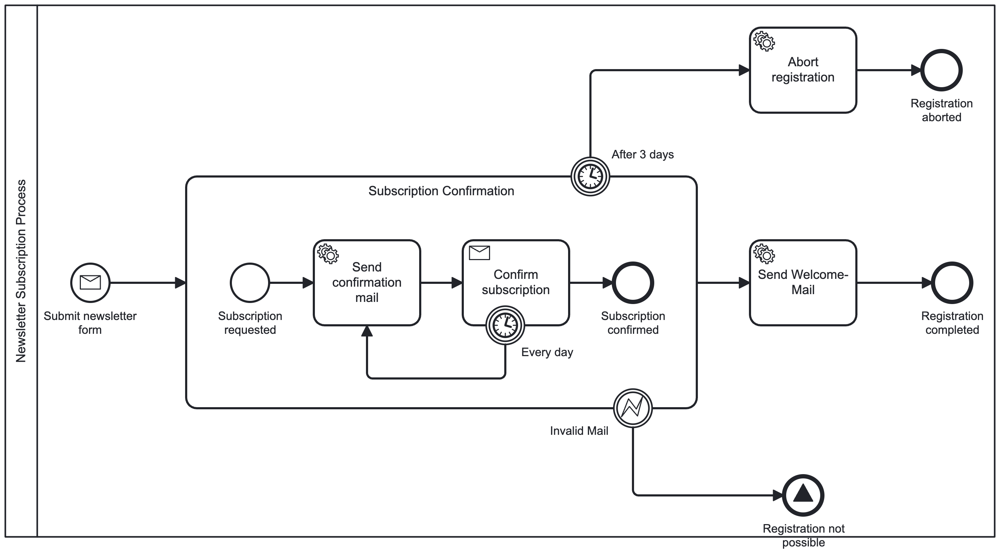

# CIB Seven Developer Training Exercises

Practical exercises for the CIB Seven developer training. The project implements a newsletter subscription workflow using CIB Seven as the process engine and a hexagonal architecture to keep business logic decoupled from infrastructure.

---

## Repository Structure

```
cibseven-developer-training-exercises/
├── exercises/                        # Starter template with TODOs
│   ├── docs/                         # Exercise descriptions (exercise-0.md … exercise-7.md)
│   └── src/main/java/io/miragon/training/
│       ├── adapter/
│       │   ├── inbound/
│       │   │   ├── cibseven/         # JavaDelegate implementations
│       │   │   └── rest/             # REST controllers
│       │   └── outbound/
│       │       ├── cibseven/         # Process engine adapter (start/correlate)
│       │       └── db/               # JPA persistence adapter
│       ├── application/
│       │   ├── port/
│       │   │   ├── inbound/          # Use case interfaces
│       │   │   └── outbound/         # Repository and process port interfaces
│       │   └── service/              # Use case implementations
│       └── domain/                   # Domain model (pure Java, no framework deps)
├── solutions/                        # Cumulative solutions per exercise
│   └── exercise-{0-7}/
├── models/                           # Reference BPMN/DMN models
├── stack/
│   ├── docker-compose.yml            # PostgreSQL + MailHog
│   └── init-schemas.sql
└── pom.xml
```

---

## Technical Stack

| Component | Technology |
|---|---|
| Language | Java 21 |
| Framework | Spring Boot 3.5 |
| Process Engine | CIB Seven 2.1 |
| Database | PostgreSQL (JPA / Hibernate) |
| Build | Maven |
| Architecture tests | ArchUnit |

---

## CIB Seven

[CIB Seven](https://cibseven.org) is a community-maintained distribution of Camunda Platform 7. It provides full compatibility with the Camunda 7 API while being independently maintained and open-source.

In this project CIB Seven runs embedded inside Spring Boot, exposes the Camunda web application at `http://localhost:8080/camunda`, and handles BPMN process execution for the newsletter subscription workflow.

Service tasks are implemented using the `JavaDelegate` pattern via `DelegateExpression`:

```java
@Component
public class SendWelcomeMailDelegate extends BaseDelegate {

    private final SendWelcomeMailUseCase useCase;

    public SendWelcomeMailDelegate(SendWelcomeMailUseCase useCase) {
        this.useCase = useCase;
    }

    @Override
    protected void executeTask(DelegateExecution execution) {
        var subscriptionId = (String) execution.getVariable("subscriptionId");
        useCase.sendWelcomeMail(new SubscriptionId(UUID.fromString(subscriptionId)));
    }
}
```

---

## Architecture

The project follows a **hexagonal architecture** (ports & adapters):

```
REST / JavaDelegates           Application              CIB7 / Database
  (inbound adapters)   →   ports + services   →     (outbound adapters)
                               ↑
                            Domain
                        (engine-neutral)
```

Architecture rules are enforced at build time via [ArchUnit](https://www.archunit.org/) tests.

---

## Exercises

### Background: Miravelo

**Miravelo** is a lifestyle online shop for people in their quarterlife crisis — gravel bikes for the weekends that count, road bikes for everyone who wants to feel the asphalt beneath their wheels.

The customer base is growing. New products are launching. The team decides: we need a **newsletter**. So customers stay informed about new drops, product launches, and exclusive offers. Classic. Down to earth. No frills. Someone signs up, gets a welcome mail — done.

> *"That's built in an hour, tops."*
> — Every developer who has ever underestimated a newsletter.

This training takes place in the context of the **Newsletter Registration** process. Starting from exercise 3, the simple newsletter evolves into the exclusive **Miravelo Inner Circle** — a limited membership for true fans of the brand. Gravel bike in the garage, half-marathon on the calendar — you know who we mean.

What follows is a journey through progressively more complex BPMN patterns: gateways, boundary events, subprocesses, signals, call activities, DMN decision tables, and compensation — each exercise building on the last.



### Exercise Overview

Detailed exercise descriptions are in [`exercises/docs/`](exercises/docs/).

| Exercise | Topic | Description |
|---|---|---|
| 0 | BPMN Modeling | Install Camunda Modeler, model a basic newsletter process |
| 1 | Process Automation | JavaDelegate, RuntimeService, REST endpoint |
| 2 | Confirmation Mail | Double-Opt-In pattern, additional service tasks |
| 3 | Membership & Gateway | Exclusive gateway, capacity check, domain refactoring |
| 4 | Boundary Events & Subprocesses | Timer, message boundary events, embedded subprocess |
| 5 | Signal Events | Signal end/start events, event publishing |
| 6 | Call Activity & DMN | Call activity, DMN decision table, business rule task |
| 7 | Compensation (SAGA) | Compensation boundary events, automatic rollback |

---

## Quick Start

```bash
# Start PostgreSQL
cd stack && docker-compose up -d

# Build everything
./mvnw clean install

# Run the exercises starter
cd exercises && ../mvnw spring-boot:run

# CIB Seven Cockpit
open http://localhost:8080/camunda    # admin / admin
```
