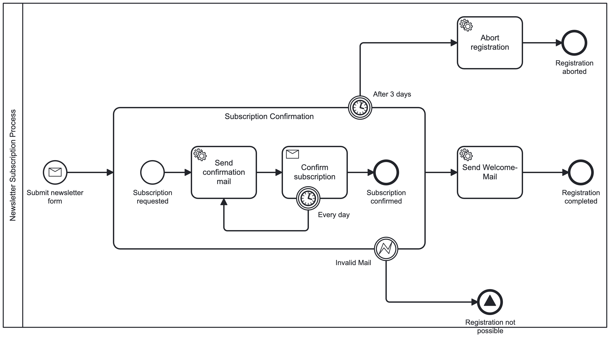

# CIB Seven Developer Training Exercises

Praxisübungen für das CIB Seven Developer Training. Das Projekt implementiert einen Newsletter-Anmeldeprozess mit CIB Seven als Process Engine und einer hexagonalen Architektur, die Business-Logik von Infrastruktur entkoppelt.

## Übungen

### Hintergrund: Miravelo

**Miravelo** ist ein Lifestyle-Online-Shop für Menschen in der Quarterlife-Crisis —
Gravel Bikes für die Wochenenden, die zählen, und Rennräder für alle, die den
Asphalt unter den Reifen spüren wollen.

Die Kundenbasis wächst. Neue Produkte kommen raus. Das Team beschließt:
Wir bauen einen **Newsletter**. Damit Kunden über neue Drops, Produkt-Launches
und exklusive Angebote informiert bleiben.
Klassisch. Bodenständig. Kein Schnickschnack.
Jemand trägt sich ein, kriegt eine Welcome Mail – fertig.

> *„Das ist doch in einer Stunde gebaut."*
> — Jeder Entwickler, der einen Newsletter unterschätzt hat.

Das Training findet im Kontext des **Newsletter-Anmeldeprozesses** statt.
Ab Aufgabe 4 wird aus dem einfachen Newsletter der exklusive **Miravelo Inner Circle** —
eine limitierte Membership für echte Fans der Marke. Gravel Bike in der Garage,
Halbmarathon im Kalender – du weißt, wen wir meinen.

Was folgt, ist eine Reise durch immer komplexere BPMN-Muster: Gateways, Boundary Events,
Subprozesse, Signals, Call Activities, DMN-Entscheidungstabellen und Kompensation —
jede Aufgabe baut auf der vorherigen auf.



### Aufgabenübersicht

Detaillierte Aufgabenbeschreibungen befinden sich in [`exercise/docs/`](exercise/docs/).

| Aufgabe | Thema | Beschreibung |
|---|---|---|
| 0 | Fachliche BPMN-Modellierung | Miragon BPMN Modeler kennenlernen, Prozess rein fachlich modellieren |
| 1 | Engine & Tooling | Lauffähigen Newsletter deployen, Cockpit & DB-Tabellen der Engine kennenlernen |
| 2 | Technische Modellierung & Automatisierung | Technisch modellieren, JavaDelegate, RuntimeService, REST-Endpoint |
| 3 | Bestätigungs-Mail | Double-Opt-In-Pattern, weitere Service Tasks |
| 4 | Membership & Gateway | Exclusive Gateway, Kapazitätsprüfung, Domain-Refactoring |
| 5 | Boundary Events & Subprozesse | Timer, Message Boundary Events, Subprocess |
| 6 | Signal Events | Signal End/Start Events, Event-Publishing |
| 7 | Kompensation (SAGA) | Compensation Boundary Events, automatisches Rollback |
| 8 | Call Activity & DMN | Call Activity, DMN-Entscheidungstabelle, Business Rule Task |
| Extra 1 | Process-Engine-API | Aufgabe 8 engine-neutral umbauen: Worker statt JavaDelegate, Adapter-Tausch statt Engine-Lock-in |

## Quick Start

```bash
# PostgreSQL starten
cd stack && docker-compose up -d

# Alles bauen
./mvnw clean install

# Exercise-Modul starten (das eine Modul, in dem du alle Aufgaben bearbeitest)
cd exercise && ../mvnw spring-boot:run

# CIB Seven Cockpit
open http://localhost:8080/camunda    # admin / admin
```

### Lösung einer Aufgabe laden

Das `exercise`-Modul startet im Zustand von **Aufgabe 1** (Engine noch auskommentiert). Wenn du
eine Aufgabe nicht ganz fertig bekommst, kannst du die Referenzlösung in dein `exercise`-Modul
kopieren und mit ihr weiterarbeiten:

```bash
# solutions/exercise-2 in das exercise-Modul kopieren (gültige Werte: 1–8)
./mvnw -pl exercise antrun:run@load-solution -Dsolution=2
```

Der Task ersetzt `src/main` komplett (Java, `application.yaml`, BPMN/DMN); `src/test` bleibt
unberührt. Alle Module – das `exercise`-Modul **und** alle Solutions – laufen auf demselben Port
(`8080`) und demselben DB-Schema (`exercise`); es läuft also immer nur **ein** Modul zur Zeit.
Die in **Aufgabe 1** aktivierten CIB-Seven-Abhängigkeiten (`pom.xml`) bleiben bestehen – lade
eine Lösung ab `exercise-2` daher erst, nachdem Aufgabe 1 abgeschlossen ist.

## Repository-Struktur

```
cibseven-developer-training-exercises/
├── exercise/                         # Das eine Arbeitsmodul (startet im Zustand von Aufgabe 1)
│   ├── docs/                         # Aufgabenbeschreibungen (exercise-0.md … exercise-8.md)
│   └── src/main/java/io/miragon/training/
│       ├── adapter/
│       │   ├── inbound/
│       │   │   ├── cibseven/         # JavaDelegate-Implementierungen
│       │   │   └── rest/             # REST-Controller
│       │   └── outbound/
│       │       ├── cibseven/         # Process-Engine-Adapter (Start/Korrelation)
│       │       └── db/               # JPA-Persistence-Adapter
│       ├── application/
│       │   ├── port/
│       │   │   ├── inbound/          # Use-Case-Interfaces
│       │   │   └── outbound/         # Repository- und Prozess-Port-Interfaces
│       │   └── service/              # Use-Case-Implementierungen
│       └── domain/                   # Domain-Modell (reines Java, keine Framework-Abhängigkeiten)
├── solutions/                        # Kumulative Lösungen pro Aufgabe (exercise-1 … exercise-8, extra-task-1)
│   └── exercise-{1-8}/
├── models/                           # Referenz-BPMN-/DMN-Modelle
├── stack/
│   ├── docker-compose.yml            # PostgreSQL + MailHog
│   └── init-schemas.sql
└── pom.xml
```

## Technologie-Stack

| Komponente | Technologie |
|---|---|
| Sprache | Java 21 |
| Framework | Spring Boot 4 |
| Process Engine | CIB Seven 2.2.0 |
| Datenbank | PostgreSQL (JPA / Hibernate) |
| Build | Maven |
| Architektur-Tests | ArchUnit |

## CIB Seven

[CIB Seven](https://cibseven.org) ist eine community-gepflegte Distribution von Camunda Platform 7. Sie bietet volle Kompatibilität mit der Camunda-7-API und wird unabhängig als Open Source weiterentwickelt.

In diesem Projekt läuft CIB Seven eingebettet in Spring Boot, stellt die Camunda-Webanwendung unter `http://localhost:8080/camunda` bereit und übernimmt die BPMN-Prozessausführung für den Newsletter-Anmeldeprozess.

Service Tasks werden über das `JavaDelegate`-Pattern mit `DelegateExpression` angebunden:

```java
@Component
public class SendWelcomeMailDelegate extends BaseDelegate {

    private final SendWelcomeMailUseCase useCase;

    public SendWelcomeMailDelegate(SendWelcomeMailUseCase useCase) {
        this.useCase = useCase;
    }

    @Override
    protected void executeTask(DelegateExecution execution) {
        var subscriptionId = (String) execution.getVariable("subscriptionId");
        useCase.sendWelcomeMail(new SubscriptionId(UUID.fromString(subscriptionId)));
    }
}
```

## Architektur

Das Projekt folgt einer **hexagonalen Architektur** (Ports & Adapters):

```
REST / JavaDelegates           Application              CIB7 / Database
  (Inbound-Adapter)    →   Ports + Services   →     (Outbound-Adapter)
                               ↑
                            Domain
                        (engine-neutral)
```

Architekturregeln werden zur Build-Zeit über [ArchUnit](https://www.archunit.org/)-Tests sichergestellt.
