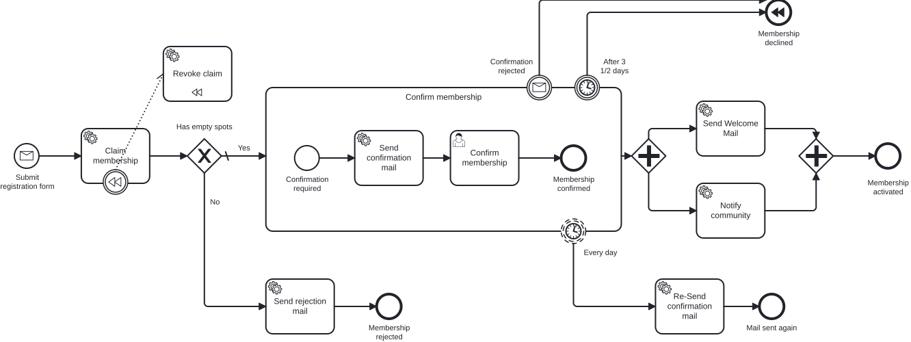

# Aufgabe 0 – Den Prozess fachlich modellieren

> **Voraussetzung:** keine – das ist der Einstieg.
> **Arbeitsverzeichnis:** ein beliebiger Ordner deiner Wahl (noch kein Code, noch kein Modul).
> **Neu in dieser Aufgabe:** BPMN-Modeler, Start Event, User Task, Service Task, End Event.

## Darum geht es

**Miravelo** ist ein Online-Shop für hochwertige Fahrräder – Gravel Bikes für lange
Wochenendtouren, Rennräder für alle, die es auf dem Asphalt schnell mögen. Die Kundschaft
ist jung, markenbewusst und ziemlich leidenschaftlich.

Der Shop wächst, neue Produkte kommen laufend dazu, und das Team beschließt: Wir bauen einen
**Newsletter**. Jemand trägt sich ein, bekommt eine Willkommens-Mail – fertig.

> *„Das ist doch in einer Stunde gebaut."*
> — Jeder Entwickler, der einen Newsletter unterschätzt hat.

Bevor irgendetwas automatisiert wird, hältst du den Ablauf **fachlich** fest: Was passiert,
in welcher Reihenfolge? Das ist die Sprache, in der Fachbereich und Entwicklung sich einig
werden – ohne eine Zeile Technik.

## Lernziele

Nach dieser Aufgabe kannst du

- einen BPMN-Modeler installieren und darin ein Modell anlegen,
- die vier Grundelemente Start Event, User Task, Service Task und End Event unterscheiden,
- einen Geschäftsprozess als durchgängigen Ablauf modellieren,
- Elemente so benennen, dass ein Fachbereich sie ohne Rückfragen versteht.

## Ziel-Modell



```
[Newsletter wanted]  →  [Fill out form]  →  [Send Welcome Mail]  →  [User subscribed]
   (Start Event)          (User Task)         (Service Task)           (End Event)
```

## Aufgabe

### 1. Modeler installieren

Wir arbeiten mit dem **[Miragon BPMN Modeler](https://miragon.github.io/bpmn-modeler/)**.
Es gibt ihn als VS-Code-Extension, als IntelliJ-Plugin und als eigenständige Desktop-App –
nimm die Variante, die zu deiner Umgebung passt.

### 2. Prozess modellieren

Lege ein neues BPMN-Diagramm an und modelliere den Anmeldeprozess mit genau diesen vier
Elementen:

| Element | Typ | Name |
|---|---|---|
| Start | None Start Event | Newsletter wanted |
| Formular | User Task | Fill out form |
| Willkommens-Mail | Service Task | Send Welcome Mail |
| Ende | None End Event | User subscribed |

### 3. Ablauf verbinden

Verbinde die Elemente mit Sequenzflüssen zu einem durchgängigen Pfad vom Start Event bis
zum End Event.

### 4. Modell sichern

Speichere die Datei als `newsletter.bpmn` in einem Ordner deiner Wahl. Du brauchst sie in
**Aufgabe 2** wieder.

## Randbedingungen

- **Nur fachlich.** Es geht ausschließlich um Ablauf und Benennung. Prozess- und
  Element-IDs nach Konvention, Formularfelder, die Anbindung des Service Tasks an Java-Code
  sowie `isExecutable` und `historyTimeToLive` lässt du hier bewusst weg.
- **Noch nicht ins Modul kopieren.** Unter `services/process-application/src/main/resources/bpmn/`
  liegt bereits ein `newsletter.bpmn` – das ist die technisch fertige Fassung, die du in
  Aufgabe 1 brauchst. Überschreibe sie jetzt noch nicht.
- Namen in den Modellen sind durchgehend englisch; die Aufgabenbeschreibungen gibt es auf
  Deutsch und Englisch.

## Erwartetes Ergebnis

Dein Modell zeigt vier Elemente in einer Reihe, verbunden durch drei Sequenzflüsse. Der
Modeler meldet keine Fehler, und jemand aus dem Fachbereich könnte den Ablauf vorlesen,
ohne nachzufragen, was ein einzelnes Element bedeutet.

## Selbstcheck

- [ ] Das Modell enthält genau ein Start Event und ein End Event
- [ ] User Task und Service Task stehen in der richtigen Reihenfolge dazwischen
- [ ] Alle vier Elemente sind über Sequenzflüsse verbunden – kein loses Element
- [ ] Die Namen entsprechen der Tabelle oben
- [ ] Die Datei liegt als `newsletter.bpmn` gespeichert vor

## Hinweise

Warum ein User Task und ein Service Task? Der **User Task** wartet auf einen Menschen –
jemand füllt das Formular aus. Der **Service Task** wird von einem System erledigt – hier
der Mailversand. Diese Unterscheidung ist die wichtigste beim fachlichen Modellieren:
Sie legt fest, wo der Prozess wartet und wo er von allein weiterläuft.

## Referenzlösung

`../../models/exercise-00/newsletter.bpmn` – öffne das Modell im Modeler und vergleiche es
mit deinem.

## Nächster Schritt

In Aufgabe 1 bringst du die Engine zum Laufen, die genau solche Modelle ausführt.

➡️ [Weiter zu Aufgabe 1](exercise-01.md)
