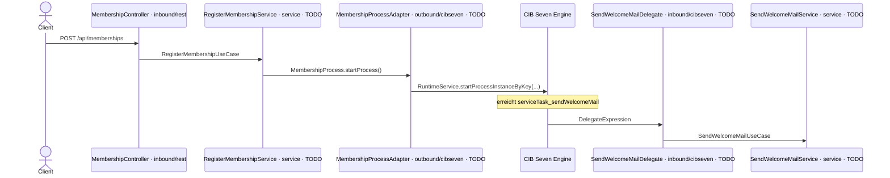

# Aufgabe 2 – Den ersten Ausschnitt sauber automatisieren

> **Voraussetzung:** Aufgabe 1 ist abgeschlossen – die Engine startet und deployt `membership.bpmn`.
> **Arbeitsverzeichnis:** `services/process-application`
> **Neu in dieser Aufgabe:** technische Modellierung, Generated Form selbst erstellen, JavaDelegate, hexagonale Architektur, Prozessstart über `RuntimeService`.

## Darum geht es

Der Inner Circle geht an den Start, und die ersten Registrierungen kommen rein – bislang klickt
sie noch jemand von Hand im Cockpit durch. Das ist keine Lösung. Wir sind Entwickler, wir
automatisieren das.

Aber nicht auf der rudimentären Fassung aus Aufgabe 1 – die war ein Wegwerf-Prototyp, nur zum
Anwerfen der Engine. Jetzt baust du den **ersten Ausschnitt des Sollprozesses** aus Aufgabe 0
sauber **neu** und überschreibst damit die alte Version.

> *„Ich klick das doch nicht 500 Mal von Hand durch."*
> — Das gesamte Team, zur Gravel-Bike-Saison

Der Ausschnitt bleibt klein: Registrierung über ein Formular, dann eine Willkommens-Mail. Neu
ist, dass **du** das Modell baust, die Form selbst erstellst und der Service Task echten
Java-Code ausführt.

## Lernziele

Nach dieser Aufgabe kannst du

- ein fachliches BPMN technisch vervollständigen (Element-IDs, Prozess-Key,
  `isExecutable`, `historyTimeToLive`),
- eine **Generated Form** im Modeler selbst erstellen und mit einem User Task verknüpfen,
- einen Service Task über eine **Delegate Expression** an eine Spring-Bean binden,
- die Schichten der hexagonalen Architektur einer Anfrage entlang benennen,
- eine Prozessinstanz aus Java über den `RuntimeService` starten,
- einen REST-Endpunkt implementieren, der den Prozess anstößt.

## Ziel-Modell


Referenzmodell: `../../models/exercise-02/membership.bpmn`

Der Ausschnitt entspricht dem Anfang des Sollprozesses aus Aufgabe 0. Was gegenüber der
rudimentären Fassung dazukommt: Du baust ihn selbst, und der Service Task ruft nicht mehr eine
Inline-Expression auf, sondern deinen Java-Code.

So wandert eine Anfrage durch die Architektur – und so ruft die Engine später in deinen
Code zurück (die mit `TODO` markierten Beteiligten füllst du in dieser Aufgabe):



## Aufgabe

### 1. Business-Schicht reaktivieren

Die Klassen für diese Aufgabe sind mit `TODO Exercise 2` auskommentiert – sie hingen an der
erst in Aufgabe 1 aktivierten Engine und wurden bis dahin geparkt. Entferne in diesen Dateien
jeweils die Zeilen mit `/*` und `*/`, damit sie wieder kompilieren:

- `application/service/RegisterMembershipService.java`
- `application/service/SendWelcomeMailService.java`
- `adapter/inbound/rest/MembershipController.java`
- `adapter/inbound/cibseven/BaseDelegate.java`
- `adapter/inbound/cibseven/SendWelcomeMailDelegate.java`
- `adapter/outbound/cibseven/MembershipProcessAdapter.java`

Das Einkommentieren ist nur die Vorbereitung, nicht das Ergebnis. `MembershipController` und
die Delegate-Basisklasse `BaseDelegate` sind danach fertig; die beiden Services (Schritte 5–6)
und – das eigentliche Herz dieser Aufgabe – der Delegate und der Prozess-Adapter (Schritte 7–8)
tragen weiterhin ein `TODO`. Die Engine-Anbindung dort schreibst du selbst.

### 2. Das Modell neu bauen

Wirf die rudimentäre Fassung weg und modelliere den Ausschnitt selbst. Nimm den Anfang deines
Sollprozesses aus Aufgabe 0 – Start, ein User Task, ein Service Task, Ende – und ergänze im
Miragon BPMN Modeler die technischen Attribute. Ersetze damit die Datei
`src/main/resources/bpmn/membership.bpmn` im Modul.

**Element-IDs und Namen:**

| Element | Typ | ID | Name |
|---|---|---|---|
| Start | None Start Event | `startEvent_membershipWanted` | Membership wanted |
| Formular | User Task | `userTask_fillOutForm` | Fill out form |
| Willkommens-Mail | Service Task | `serviceTask_sendWelcomeMail` | Send Welcome Mail |
| Ende | None End Event | `endEvent_memberJoined` | Member joined |

**Prozess-Eigenschaften:** Prozess-Key `subscribeNewsletter` · `Executable` aktiviert ·
`History Time To Live` = `180`

> **Hinweis: Prozess-Key.** Der Anzeigename des Prozesses lautet `Join Inner Circle`, sein
> technischer Prozess-Key bleibt aber aus historischen Gründen `subscribeNewsletter`. Der Key
> ist der Name, unter dem die Engine die Definition führt und über den du sie gleich startest –
> er wird ab jetzt nicht mehr geändert.

### 3. Die Generated Form selbst erstellen

In Aufgabe 1 hast du eine fertige Generated Form nur benutzt – jetzt legst du sie selbst an. Wähl
im Modeler den User Task `userTask_fillOutForm` aus und ergänze im Properties Panel unter
**Forms** eine Generated Form mit diesen Feldern:

| Feld-ID | Label | Typ |
|---|---|---|
| `email` | E-Mail | string |
| `name` | Name | string |
| `age` | Age | long |

Die Feld-IDs landen als Prozessvariablen in der Instanz, sobald jemand den Task abschließt – die
Tasklist rendert das Formular automatisch daraus.

### 4. Service Task an den Delegate binden

Das ist die inhaltliche Änderung gegenüber der rudimentären Fassung:

| Element | Vorher (Aufgabe 1) | Jetzt |
|---|---|---|
| `serviceTask_sendWelcomeMail` | Implementation: *Expression*, `${execution.setVariable('welcomeMailSentTo', email)}` | Implementation: **Delegate Expression**, `#{sendWelcomeMailDelegate}` |

### 5. `RegisterMembershipService` implementieren

**Datei:** `application/service/RegisterMembershipService.java`

Ersetze das `TODO` durch diese Logik:

1. Erstelle ein `Membership`-Objekt aus E-Mail, Name und Alter des Commands.
2. Speichere es über das Repository.
3. Starte den Prozess über den Process-Port.
4. Gib `membership.id()` zurück.

### 6. `SendWelcomeMailService` implementieren

**Datei:** `application/service/SendWelcomeMailService.java`

Lade die Membership über das Repository und logge die E-Mail-Adresse, an die die
Willkommens-Mail geht.

### 7. `SendWelcomeMailDelegate` implementieren

**Datei:** `adapter/inbound/cibseven/SendWelcomeMailDelegate.java`

Ersetze das `TODO` in `executeTask(execution)` durch die Engine-Anbindung – **das schreibst
du selbst**:

- Lies die Prozessvariable `membershipId` über die `DelegateExecution` aus.
- Wandle den Wert in eine `MembershipId` und rufe damit `useCase.sendWelcomeMail(...)` auf.

Welche Methode der `DelegateExecution` die Variable liefert und wie du den String konvertierst,
findest du selbst heraus – der Aufgabentext nennt dir die API, nicht die fertige Zeile.

### 8. `MembershipProcessAdapter` implementieren

**Datei:** `adapter/outbound/cibseven/MembershipProcessAdapter.java`

Ersetze das `TODO` in `startProcess(membership)` durch den Prozessstart über den
`RuntimeService` – **auch das schreibst du selbst**:

- Starte eine Instanz zum Prozess-Key `subscribeNewsletter`. Die passende `RuntimeService`-Methode,
  die eine Instanz per Key startet, heißt `startProcessInstanceByKey`.
- Übergib die Prozessvariablen `membershipId`, `email`, `name` und `age` als Map. Die
  Schlüssel müssen exakt den Variablennamen im Modell entsprechen.

Wie du Prozess-Key und Variablen-Map zum Aufruf zusammensetzt, baust du selbst zusammen.

## Randbedingungen

- **Element-ID-Konvention** – ab jetzt in jeder Aufgabe verbindlich:

  | Präfix | Für |
  |---|---|
  | `startEvent_` | Start Events |
  | `endEvent_` | End Events |
  | `userTask_` | User Tasks |
  | `serviceTask_` | Service Tasks |
  | `gateway_` | Gateways |
  | `subProcess_` | Subprozesse |
  | `boundaryEvent_` | Boundary Events |

- Der Delegate ist ein **Adapter**: Er liest Prozessvariablen und ruft einen Use Case auf.
  Fachlogik gehört in den Service, nicht in den Delegate.
- Die Domain-Klassen (`domain/`) bleiben frei von Framework-Importen. Der ArchUnit-Test
  `ArchitectureTest` prüft das.

## Erwartetes Ergebnis

Starte die Anwendung neu, damit das neue Modell deployt wird:

```bash
cd services/process-application && ../../mvnw spring-boot:run
```

Löse den Prozess anschließend über die REST-Schnittstelle aus – ab jetzt startet ihn keine
Person mehr von Hand im Cockpit:

```bash
curl -X POST http://localhost:8080/api/memberships \
  -H "Content-Type: application/json" \
  -d '{"email": "alice@miravelo.com", "name": "Alice", "age": 28}'
```

Der Aufruf liefert die ID der Membership. Im Cockpit
(`http://localhost:8080/webapp/#/seven/auth/start`, admin/admin) läuft daraufhin eine Instanz von
`Join Inner Circle`, in der **Tasklist** steht `Fill out form`. Nach dem Abschließen des
Tasks läuft der Service Task durch und im Log erscheint
`Sending welcome mail to alice@miravelo.com`.

## Selbstcheck

- [ ] Die sechs Klassen kompilieren wieder; `SendWelcomeMailDelegate` und
      `MembershipProcessAdapter` sind selbst implementiert (kein `UnsupportedOperationException`-Stub mehr)
- [ ] Der User Task `userTask_fillOutForm` trägt eine selbst erstellte Generated Form mit
      `email`, `name`, `age`
- [ ] Der Service Task nutzt `#{sendWelcomeMailDelegate}` statt der Inline-Expression
- [ ] Ein `POST /api/memberships` erzeugt eine Prozessinstanz mit den vier Prozessvariablen
- [ ] Nach Abschluss des User Tasks steht die Log-Zeile mit der E-Mail-Adresse im Log
- [ ] Die Instanz endet an `endEvent_memberJoined`
- [ ] `./mvnw -pl services/process-application test -Dtest=ArchitectureTest` ist grün

## Hinweise

Prozess-Tests bekommen in [Aufgabe 5](exercise-05.md) ihren eigenen Platz – dort schreibst
du einen vollwertigen Test gegen den dann fertigen Prozess. Der Platzhalter liegt bereits
unter `src/test/java/io/miragon/training/process/MembershipProcessTest.java`.

## Referenzlösung

`../../solutions/exercise-02/` – oder direkt laden:

```bash
./mvnw -pl services/process-application antrun:run@load-solution -Dsolution=02
```

## Nächster Schritt

In Aufgabe 3 kommt der Bestätigungsschritt dazu – und der Prozess wird nicht mehr direkt,
sondern über eine Nachricht gestartet.

➡️ [Weiter zu Aufgabe 3](exercise-03.md)
