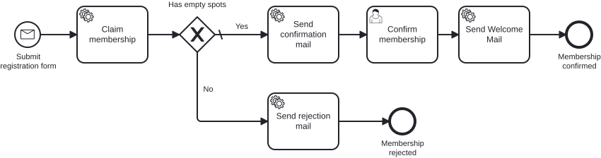

# Aufgabe 5 – Den Prozess mit Tests absichern

> **Voraussetzung:** Aufgabe 4 ist abgeschlossen – Gateway, Kapazitätsprüfung und beide Prozessausgänge laufen.
> **Arbeitsverzeichnis:** `services/process-application`
> **Neu in dieser Aufgabe:** In-Memory-Engine mit h2, abgeschalteter Job Executor, `@MockitoBean`, Assertions mit `BpmnAwareTests`.

## Darum geht es

**Montagmorgen. Der Prozess läuft. Angeblich.**

Du hast einen ordentlichen Prozess gebaut: Gateway, Bestätigungs-Mail, Ablehnung. In der
Cockpit-Demo hat alles funktioniert – einmal. Aber woher weißt du, dass er **nächste Woche
noch** funktioniert, wenn jemand ein Boundary Event anhängt, einen Sequenzfluss umbiegt oder
eine Bedingung dreht?

Klickst du dann jedes Mal durchs Cockpit? Startest PostgreSQL, schickst curl-Aufrufe ab,
liest Logs? Das macht niemand zuverlässig. Genau da sterben Prozesse leise: Ein Sequenzfluss
zeigt nach dem Refactoring ins Leere, das Gateway nimmt den falschen Pfad – und keiner merkt
es, bis jemand trotz freiem Platz eine Absage bekommt.

> *„Works on my machine" ist kein Testkonzept. Es ist eine Ausrede mit besserer PR.*

Ein **Prozess-Test** startet den echten Prozess in einer In-Memory-Engine, lässt die echten
Delegates laufen und ersetzt nur die Fachlogik dahinter durch Mocks. Welchen Weg die
Prozessinstanz nehmen muss, steht danach als **Assertion** im Test – überprüfbar bei jedem
Build statt einmalig in einer Demo.

## Lernziele

Nach dieser Aufgabe kannst du

- einen Prozess als Unit-Test absichern, ohne PostgreSQL und ohne laufende Infrastruktur,
- die Engine im Test auf h2 und mit abgeschaltetem Job Executor betreiben,
- die Use Cases hinter den Delegates mit `@MockitoBean` gezielt mocken,
- die Async-Continuations im Test selbst ausführen und die Instanz damit kontrolliert bis
  zum nächsten Wait State bringen,
- Prozesspfade mit `BpmnAwareTests` prüfen (`isWaitingAt`, `hasPassedInOrder`, `isEnded`).

## Ziel-Modell



Es kommt **kein neues Modell** dazu. Du testest den Prozess aus Aufgabe 4: Message Start →
Claim → Gateway → Bestätigung → Willkommens-Mail beziehungsweise Ablehnung.

Referenzmodell (unverändert gegenüber Aufgabe 4): `../../models/exercise-05/newsletter.bpmn`

## Aufgabe

### 1. Test-Dependency ergänzen

Die Assertions kommen aus dem CIB-Seven-Port von `camunda-bpm-assert`. Die Version ist
zentral in der Root-`pom.xml` gemanagt:

```xml
<dependency>
    <groupId>org.cibseven.bpm</groupId>
    <artifactId>cibseven-bpm-assert</artifactId>
    <scope>test</scope>
</dependency>
```

`spring-boot-starter-test` (JUnit 5, Mockito, AssertJ) und `h2` sind bereits vorhanden.

### 2. Testprofil anlegen

**Neue Datei:** `src/test/resources/application-test.yaml`

```yaml
spring:
  main:
    allow-bean-definition-overriding: true
  datasource:
    url: jdbc:h2:mem:cibseven-test;DB_CLOSE_DELAY=-1;INIT=CREATE SCHEMA IF NOT EXISTS exercise
    username: sa
    password:
    driver-class-name: org.h2.Driver
  jpa:
    hibernate:
      ddl-auto: create-drop
    properties:
      hibernate:
        dialect: org.hibernate.dialect.H2Dialect
        default_schema: exercise

camunda:
  bpm:
    admin-user:
      id: admin
      password: admin
    database:
      type: h2
      schema-update: true
    job-execution:
      enabled: false   # <-- der Kern: die Async-Continuations führen wir selbst aus
    webapp:
      enabled: false

# Der Webapp-Bean validiert dieses Secret beim Start, auch wenn die Webapp aus ist:
cibseven:
  webclient:
    authentication:
      jwtSecret: M9nU3ORo3s+gK23D9mO5I2h+EIqnosCFDCJi+2bKoulKqZkeQT8pGYg5RhuORlf/fWhLu5meC/SPZCv9NNuj6SK/vE5Sid04UQGrnyh04EpBdiAosAO91xezjgmbSeALUtneibseGpS0tNE4RvLIl+gXiAKqNXyO
```

> **Begriff: Job Executor.** Der Hintergrund-Thread der Engine. Er holt sich die Jobs, die
> bei einer asynchronen Continuation (`asyncBefore` / `asyncAfter` aus
> [Aufgabe 4](exercise-04.md)) entstehen, und arbeitet sie ab – im Betrieb genau richtig,
> im Test eine Quelle für Zufall: Der Test weiß nie, wie weit die Instanz gerade ist.
> Deshalb schalten wir ihn ab und führen die Jobs selbst aus.

### 3. Test-Helfer anlegen

**Neue Datei:** `src/test/java/io/miragon/training/process/util/ProcessEngineTestUtils.java`

Zwei Helfer reichen für diese Aufgabe:

- `continueToNextWaitState(processEngine)` – führt die offenen Async-Jobs nacheinander aus,
  bis die Instanz ihren nächsten Wait State (User Task oder Ende) erreicht.
- `findProcessInstance(runtimeService, membershipId)` – findet die laufende Instanz über den
  Prozess-Key `subscribeNewsletter` und die Variable `membershipId`.

```java
public static void continueToNextWaitState(ProcessEngine processEngine) {
    ManagementService ms = processEngine.getManagementService();
    for (int i = 0; i < 50; i++) {
        Job job = ms.createJobQuery().active().messages().listPage(0, 1)
                .stream().findFirst().orElse(null);
        if (job == null) return;
        ms.executeJob(job.getId());
    }
}
```

Den `fireTimer`-Helfer brauchst du erst mit den Boundary Events in Aufgabe 6. Die
vollständige Datei liegt in der Referenzlösung.

### 4. Happy-Path-Test schreiben

**Datei:** `src/test/java/io/miragon/training/process/MembershipProcessTest.java`

Gerüst:

```java
@SpringBootTest
@ActiveProfiles("test")
class MembershipProcessTest {

    @Autowired private MembershipProcess membershipProcess;
    @Autowired private RuntimeService runtimeService;
    @Autowired private TaskService taskService;
    @Autowired private ProcessEngine processEngine;

    @MockitoBean private ClaimMembershipUseCase claimMembershipUseCase;
    @MockitoBean private SendConfirmationMailUseCase sendConfirmationMailUseCase;
    @MockitoBean private SendRejectionMailUseCase sendRejectionMailUseCase;
    @MockitoBean private SendWelcomeMailUseCase sendWelcomeMailUseCase;

    @BeforeEach
    void setUp() {
        init(processEngine); // BpmnAwareTests.init(...)
    }
}
```

Der Happy Path: `claimMembership` liefert `true`, die Prozessinstanz wartet am User Task, du
schließt ihn ab, die Willkommens-Mail geht raus, das Ende ist `endEvent_membershipConfirmed`.

```java
@Test
void happyPath_membershipIsConfirmedAndWelcomeMailIsSent() {
    when(claimMembershipUseCase.claimMembership(any())).thenReturn(true);

    Membership membership = new Membership(new Email("jane@example.com"), new Name("Jane"), new Age(30));
    membershipProcess.startProcess(membership);

    ProcessInstance instance = findProcessInstance(runtimeService, membership.id().value().toString());
    continueToNextWaitState(processEngine);

    assertThat(instance).isWaitingAt("userTask_confirmMembership");

    String taskId = taskService.createTaskQuery()
            .processInstanceId(instance.getProcessInstanceId()).singleResult().getId();
    taskService.complete(taskId);
    continueToNextWaitState(processEngine);

    assertThat(instance)
            .isEnded()
            .hasPassedInOrder(
                    "startEvent_submitRegistration",
                    "serviceTask_claimMembership",
                    "gateway_hasEmptySpots",
                    "serviceTask_sendConfirmationMail",
                    "userTask_confirmMembership",
                    "serviceTask_sendWelcomeMail",
                    "endEvent_membershipConfirmed")
            .hasNotPassed("serviceTask_sendRejectionMail", "endEvent_membershipRejected");

    verify(sendWelcomeMailUseCase).sendWelcomeMail(membership.id());
}
```

### 5. Ablehnungspfad selbst testen

Schreibe einen zweiten Test `noCapacity_membershipIsRejected`:

- `claimMembership` liefert `false`.
- Die Prozessinstanz läuft ohne Wait State direkt bis `endEvent_membershipRejected`.
- Geprüft wird: `serviceTask_sendRejectionMail` wurde durchlaufen, Bestätigung und
  Willkommens-Mail **nicht**, und `sendWelcomeMailUseCase` wurde nie aufgerufen
  (`verify(..., never())`).

## Randbedingungen

- Der Test läuft **ohne** PostgreSQL und ohne laufenden Stack. Zwei Stellschrauben machen
  ihn schnell und reproduzierbar:
  1. **h2 statt PostgreSQL** – eine In-Memory-Datenbank, die pro Testlauf frisch angelegt
     und verworfen wird (`ddl-auto: create-drop`).
  2. **Job Executor aus** – die Continuations führst du selbst aus dem Testthread aus. Damit
     bestimmst du, wie weit die Instanz ist, wenn du deine Assertion schreibst.
- Gemockt werden **nur die Use Cases**. Delegates, Modell und Engine laufen echt – sonst
  testest du deine Mocks statt deinen Prozess.
- Die Element-IDs stehen in dieser Aufgabe noch als Strings im Test. Merk dir, wie viele es
  sind – das [Add-on](exercise-05-addon.md) räumt sie gleich weg.

## Erwartetes Ergebnis

Führe nur diese eine Testklasse aus – aus dem Wurzelverzeichnis des Repositories:

```bash
./mvnw -pl services/process-application test -Dtest=MembershipProcessTest
```

Beide Tests laufen in wenigen Sekunden durch, ohne dass PostgreSQL läuft. Schlägt einer
fehl, zeigt dir die Assertion, an welcher Aktivität die Instanz tatsächlich stand.

## Selbstcheck

- [ ] `application-test.yaml` existiert, der Job Executor ist im Testprofil abgeschaltet
- [ ] `ProcessEngineTestUtils` bringt die Instanz bis zum nächsten Wait State
- [ ] Der Happy-Path-Test prüft die Reihenfolge **und** die nicht genommenen Pfade
- [ ] Der Ablehnungstest prüft, dass die Willkommens-Mail nie aufgerufen wurde
- [ ] Beide Tests laufen grün, ohne dass der Docker-Stack läuft

## Referenzlösung

`../../solutions/exercise-05/`

## Nächster Schritt

Die Element-IDs stehen noch als handgetippte Strings im Test – fragil, sobald jemand im
Modeler umbenennt. Das Add-on macht daraus geprüfte Konstanten.

➡️ [Weiter zum Add-on: bpmn-to-code](exercise-05-addon.md)
