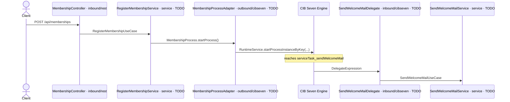

# Exercise 2 – Automate the first slice cleanly

> **Prerequisite:** Exercise 1 is complete – the engine starts and deploys `membership.bpmn`.
> **Working directory:** `services/process-application`
> **New in this exercise:** technical modeling, creating the Generated Form yourself, JavaDelegate, hexagonal architecture, starting a process via `RuntimeService`.

## What this is about

The Inner Circle goes live, and the first registrations come in – so far someone still clicks
through each one by hand in the Cockpit. That's not a solution. We're developers, we automate
things.

But not on top of the rudimentary version from Exercise 1 – that was a throwaway prototype, only
there to fire up the engine. Now you build the **first excerpt of the target process** from
Exercise 0 cleanly and **anew**, overwriting the old version with it.

> *"I'm not clicking through this 500 times by hand."*
> — The entire team, during gravel-bike season

The excerpt stays small: registration via a form, then a welcome mail. What's new is that **you**
build the model, create the form yourself, and the Service Task runs real Java code.

## Learning goals

After this exercise you can

- complete a business-level BPMN technically (element IDs, process key,
  `isExecutable`, `historyTimeToLive`),
- create a **Generated Form** in the modeler yourself and link it to a User Task,
- bind a Service Task to a Spring bean via a **Delegate Expression**,
- name the layers of the hexagonal architecture along the path of a request,
- start a process instance from Java via the `RuntimeService`,
- implement a REST endpoint that kicks off the process.

## Target model


Reference model: `../../models/exercise-02/membership.bpmn`

The excerpt matches the beginning of the target process from Exercise 0. What is added compared to
the rudimentary version: you build it yourself, and the Service Task no longer calls an inline
expression, but your Java code.

Here's how a request travels through the architecture – and how the engine later calls
back into your code (you fill in the participants marked `TODO` in this exercise):



## The task

### 1. Reactivate the business layer

The classes for this exercise are commented out with `TODO Exercise 2` – they depended on the
engine that was only activated in Exercise 1 and were parked until then. In each of these files,
remove the lines with `/*` and `*/` so they compile again:

- `application/service/RegisterMembershipService.java`
- `application/service/SendWelcomeMailService.java`
- `adapter/inbound/rest/MembershipController.java`
- `adapter/inbound/cibseven/BaseDelegate.java`
- `adapter/inbound/cibseven/SendWelcomeMailDelegate.java`
- `adapter/outbound/cibseven/MembershipProcessAdapter.java`

Uncommenting is only the preparation, not the result. `MembershipController` and the delegate
base class `BaseDelegate` are done afterwards; the two services (steps 5–6) and – the actual
heart of this exercise – the delegate and the process adapter (steps 7–8) still carry a `TODO`.
You write the engine binding there yourself.

### 2. Rebuild the model

Throw away the rudimentary version and model the excerpt yourself. Take the beginning of your
target process from Exercise 0 – Start, one User Task, one Service Task, End – and add the
technical attributes in the Miragon BPMN Modeler. Use it to replace the file
`src/main/resources/bpmn/membership.bpmn` in the module.

**Element IDs and names:**

| Element | Type | ID | Name |
|---|---|---|---|
| Start | None Start Event | `startEvent_membershipWanted` | Membership wanted |
| Form | User Task | `userTask_fillOutForm` | Fill out form |
| Welcome mail | Service Task | `serviceTask_sendWelcomeMail` | Send Welcome Mail |
| End | None End Event | `endEvent_memberJoined` | Member joined |

**Process properties:** process key `subscribeNewsletter` · `Executable` enabled ·
`History Time To Live` = `180`

> **Note: process key.** The display name of the process is `Join Inner Circle`, but its technical
> process key stays `subscribeNewsletter` for historical reasons. The key is the name under which
> the engine keeps the definition and by which you start it shortly – from now on it is never
> changed again.

### 3. Create the Generated Form yourself

In Exercise 1 you only used a finished Generated Form – now you create one yourself. Select the
User Task `userTask_fillOutForm` in the modeler and add a Generated Form under **Forms** in the
Properties Panel with these fields:

| Field ID | Label | Type |
|---|---|---|
| `email` | E-Mail | string |
| `name` | Name | string |
| `age` | Age | long |

The field IDs land as process variables in the instance as soon as someone completes the task –
the Tasklist renders the form from them automatically.

### 4. Bind the Service Task to the delegate

This is the substantive change compared to the rudimentary version:

| Element | Before (Exercise 1) | Now |
|---|---|---|
| `serviceTask_sendWelcomeMail` | Implementation: *Expression*, `${execution.setVariable('welcomeMailSentTo', email)}` | Implementation: **Delegate Expression**, `#{sendWelcomeMailDelegate}` |

### 5. Implement `RegisterMembershipService`

**File:** `application/service/RegisterMembershipService.java`

Replace the `TODO` with this logic:

1. Create a `Membership` object from the command's email, name, and age.
2. Save it via the repository.
3. Start the process via the process port.
4. Return `membership.id()`.

### 6. Implement `SendWelcomeMailService`

**File:** `application/service/SendWelcomeMailService.java`

Load the membership via the repository and log the email address the welcome mail
goes to.

### 7. Implement `SendWelcomeMailDelegate`

**File:** `adapter/inbound/cibseven/SendWelcomeMailDelegate.java`

Replace the `TODO` in `executeTask(execution)` with the engine binding – **you write this
yourself**:

- Read the process variable `membershipId` from the `DelegateExecution`.
- Convert the value into a `MembershipId` and use it to call `useCase.sendWelcomeMail(...)`.

Which method of the `DelegateExecution` returns the variable, and how you convert the string,
is for you to find out – the task names the API, not the finished line.

### 8. Implement `MembershipProcessAdapter`

**File:** `adapter/outbound/cibseven/MembershipProcessAdapter.java`

Replace the `TODO` in `startProcess(membership)` with the process start via the
`RuntimeService` – **you write this yourself too**:

- Start an instance for the process key `subscribeNewsletter`. The matching `RuntimeService`
  method that starts an instance by key is `startProcessInstanceByKey`.
- Pass the process variables `membershipId`, `email`, `name`, and `age` as a map. The
  keys must match the variable names in the model exactly.

How you assemble the process key and the variables map into the call, you build yourself.

## Constraints

- **Element ID convention** – mandatory in every exercise from now on:

  | Prefix | For |
  |---|---|
  | `startEvent_` | Start Events |
  | `endEvent_` | End Events |
  | `userTask_` | User Tasks |
  | `serviceTask_` | Service Tasks |
  | `gateway_` | Gateways |
  | `subProcess_` | Subprocesses |
  | `boundaryEvent_` | Boundary Events |

- The delegate is an **adapter**: it reads process variables and calls a use case.
  Business logic belongs in the service, not in the delegate.
- The domain classes (`domain/`) stay free of framework imports. The ArchUnit test
  `ArchitectureTest` verifies this.

## Expected result

Restart the application so the new model gets deployed:

```bash
cd services/process-application && ../../mvnw spring-boot:run
```

Then trigger the process via the REST interface – from now on no one starts it by hand
in the Cockpit anymore:

```bash
curl -X POST http://localhost:8080/api/memberships \
  -H "Content-Type: application/json" \
  -d '{"email": "alice@miravelo.com", "name": "Alice", "age": 28}'
```

The call returns the ID of the membership. In the Cockpit
(`http://localhost:8080/webapp/#/seven/auth/start`, admin/admin) an instance of
`Join Inner Circle` then runs, with `Fill out form` in the **Tasklist**. After completing the
task, the Service Task runs through and the log shows
`Sending welcome mail to alice@miravelo.com`.

## Self-check

- [ ] The six classes compile again; `SendWelcomeMailDelegate` and
      `MembershipProcessAdapter` are implemented yourself (no more `UnsupportedOperationException` stub)
- [ ] The User Task `userTask_fillOutForm` carries a self-created Generated Form with
      `email`, `name`, `age`
- [ ] The Service Task uses `#{sendWelcomeMailDelegate}` instead of the inline expression
- [ ] A `POST /api/memberships` creates a process instance with the four process variables
- [ ] After completing the User Task, the log line with the email address appears in the log
- [ ] The instance ends at `endEvent_memberJoined`
- [ ] `./mvnw -pl services/process-application test -Dtest=ArchitectureTest` is green

## Hints

Process tests get their own spot in [Exercise 5](exercise-05.md) – there you write
a full-fledged test against the then-finished process. The placeholder already lives
under `src/test/java/io/miragon/training/process/MembershipProcessTest.java`.

## Reference solution

`../../solutions/exercise-02/` – or load it directly:

```bash
./mvnw -pl services/process-application antrun:run@load-solution -Dsolution=02
```

## Next step

In Exercise 3 the confirmation step is added – and the process is no longer started directly,
but via a message.

➡️ [Next: Exercise 3](exercise-03.md)
