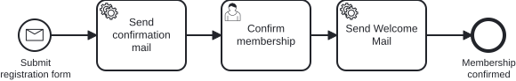

# Exercise 3 – Double-Opt-In via Confirmation Mail

> **Prerequisite:** Exercise 2 is complete – the process starts via `POST /api/subscriptions` and sends the welcome mail through a delegate.
> **Working directory:** `services/process-application`
> **New in this exercise:** Message Start Event, message correlation, a second Service Task, a confirmation User Task.

## What this is about

Rose has launched the new **Backroad AL**, and Miravelo is releasing it exclusively in the
Store. Social media goes wild, and overnight 500 sign-ups pour in.

The team stares at the database and starts asking questions:

- Are these real email addresses?
- Who is this `noreply@throwaway.xyz`?
- Someone entered `admin@miravelo.com`. As a joke. Probably.

> *"500 sign-ups. That's either viral or a bot attack."*
> — CTO, on the second coffee

The answer is a **Double-Opt-In**: confirm the mail first, then send the welcome mail. And
since the registration data now comes in via REST anyway, filling out the form moves out of
the process – from now on the process starts with a **message**.

## Learning goals

After this exercise you can

- replace a None Start Event with a **Message Start Event** and explain why,
- start a process instance via `createMessageCorrelation(...).correlateStartMessage()`,
- run multiple Service Tasks in one process,
- use a User Task as a **wait state** (a term from [Exercise 1](exercise-01.md)),
  where the process instance waits for the confirmation,
- add another use case, complete with service and delegate, following the proven pattern.

## Target model



Reference model: `../../models/exercise-03/newsletter.bpmn`

**Watch for three changes compared to Exercise 2**, not just the two new elements:

1. The Start Event is now called `startEvent_submitRegistration` ("Submit registration form")
   and is a **Message Start Event**.
2. The User Task `userTask_fillOutForm` is **removed**, along with its form fields. The
   registration data comes in via the REST call and is set as process variables at start –
   a form in the tasklist is no longer needed for that.
3. It is replaced further down the line by the new User Task `userTask_confirmSubscription`.

## The task

### 1. Switch the Start Event to a message

Open `src/main/resources/bpmn/newsletter.bpmn` in the Miragon BPMN Modeler and replace the
None Start Event with a Message Start Event:

| Property | Value |
|---|---|
| ID | `startEvent_submitRegistration` |
| Name | Submit registration form |
| Type | Message Start Event |
| Message Name | `Message_SubscriptionRequested` |

Then delete the User Task `userTask_fillOutForm` including its form fields, and connect the
Start Event to the new confirmation Service Task.

### 2. Extend the process with a confirmation step

Between the Message Start Event and the welcome mail, two elements are added: a **Service
Task** that sends the confirmation mail, and a **User Task** as a **wait state** – this is
where the process instance stops until the confirmation is reported back as a completed
task. That is exactly the state you saw in Exercise 1 in `act_ru_task`.

| Element | Type | ID | Name | Configuration |
|---|---|---|---|---|
| Confirmation mail | Service Task | `serviceTask_sendConfirmationMail` | Send confirmation mail | Delegate Expression: `#{sendConfirmationMailDelegate}` |
| Confirmation | User Task | `userTask_confirmSubscription` | Confirm subscription | – |

The Service Task comes **before** the User Task: first send the mail, then wait for the
confirmation.

### 3. Create `SendConfirmationMailUseCase`

**New file:** `application/port/inbound/SendConfirmationMailUseCase.java`

An interface with the method `sendConfirmationMail(SubscriptionId)`.

### 4. Implement `SendConfirmationMailService`

**New file:** `application/service/SendConfirmationMailService.java`

Load the subscription via the repository and log the email address the confirmation mail
goes to.

### 5. Create `SendConfirmationMailDelegate`

**New file:** `adapter/inbound/cibseven/SendConfirmationMailDelegate.java`

Use `SendWelcomeMailDelegate` as a template. The delegate reads `subscriptionId` from the
`DelegateExecution` and calls `useCase.sendConfirmationMail(...)`.

### 6. Switch the process start to correlation

**File:** `adapter/outbound/cibseven/SubscriptionProcessAdapter.java`

A Message Start Event can no longer be triggered via `startProcessInstanceByKey`. Switch
`startProcess(...)` to correlating the message:

```java
runtimeService.createMessageCorrelation("Message_SubscriptionRequested")
        .setVariables(Map.of(/* subscriptionId, email, name, age */))
        .correlateStartMessage();
```

## Constraints

- The process key stays `subscribeNewsletter`, and the message name is exactly
  `Message_SubscriptionRequested` – typos lead to a
  `MismatchingMessageCorrelationException` at runtime.
- The process variables (`subscriptionId`, `email`, `name`, `age`) stay unchanged; they are
  now set during correlation instead of at start.
- The new use case follows the same cut as the existing ones: port in `application/port/inbound`,
  implementation in `application/service`, engine binding in `adapter/inbound/cibseven`.

## Expected result

Restart the application and register a person:

```bash
curl -X POST http://localhost:8080/api/subscriptions \
  -H "Content-Type: application/json" \
  -d '{"email": "bob@miravelo.com", "name": "Bob", "age": 25}'
```

1. The Service Task `Send confirmation mail` runs through immediately – the log shows
   `Sending confirmation mail to bob@miravelo.com`.
2. The User Task `Confirm subscription` appears in the tasklist and the process instance waits.
3. After completing it, `Send Welcome Mail` runs through and the instance ends.

## Self-check

- [ ] The Start Event is a Message Start Event with the name `Message_SubscriptionRequested`
- [ ] `userTask_fillOutForm` has disappeared from the model
- [ ] The process is started via `correlateStartMessage()` and the REST call
      still returns an ID
- [ ] Both log lines (confirmation, welcome) appear in the right order
- [ ] Between the two mails, the process waits at the User Task

## Hints

**Why a Message Start Event?** A None Start Event says "someone starts this somehow". A
Message Start Event names the business trigger – *a registration has come in* – and makes it
visible in the model. Technically, it gives you the same correlation API that you'll also
need from Exercise 6 on for messages **to running instances** (rejection via a Message
Boundary Event).

## Reference solution

`../../solutions/exercise-03/` – or load it directly:

```bash
./mvnw -pl services/process-application antrun:run@load-solution -Dsolution=03
```

## Next step

In Exercise 4, the newsletter turns into a real membership – with capacity check, gateway
and transaction boundaries.

➡️ [Next: Exercise 4](exercise-04.md)
