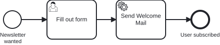

# Aufgabe 0 – Fachliche BPMN-Modellierung

## Ziel-Modell



## Lernziele

- Einen **BPMN-Modeler** installieren und kennenlernen
- Einen Geschäftsprozess **fachlich** modellieren – den Ablauf, nicht die Technik
- Die BPMN-Grundelemente kennen: Start Event, User Task, Service Task, End Event
- Sprechende, verständliche Namen vergeben

> **Tool:** Wir nutzen den **[Miragon BPMN Modeler](https://miragon.github.io/bpmn-modeler/)**.
> Es gibt ihn als VS-Code-Extension, IntelliJ-Plugin und Standalone-Desktop-App –
> nimm einfach die Variante, die dir am besten passt.

## Hintergrund

**Miravelo** ist ein Lifestyle-Online-Shop für Menschen in der Quarterlife-Crisis:
Gravel Bikes für die Wochenenden, die zählen, und Rennräder für alle, die den
Asphalt unter den Reifen spüren wollen.

Die Kundenbasis wächst. Neue Produkte kommen raus. Das Team beschließt:
Wir bauen einen **Newsletter**. Damit Kunden über neue Drops, Produkt-Launches
und exklusive Angebote informiert bleiben.
Klassisch. Bodenständig. Kein Schnickschnack.
Jemand trägt sich ein, kriegt eine Welcome Mail – fertig.

> *„Das ist doch in einer Stunde gebaut."*
> — Jeder Entwickler, der einen Newsletter unterschätzt hat.

Bevor wir irgendetwas automatisieren, halten wir den Ablauf erst einmal **fachlich**
fest: Was passiert, in welcher Reihenfolge? Das ist die Sprache, in der Fachbereich
und Entwicklung sich einig werden – ganz ohne technische Details.

### Prozess

```
[Newsletter wanted]  →  [Fill out form]  →  [Send Welcome Mail]  →  [User subscribed]
   (Start Event)          (User Task)         (Service Task)           (End Event)
```

## Aufgabe

Modelliere im Modeler den Newsletter-Anmeldeprozess **fachlich** und
speichere ihn als `src/main/resources/bpmn/newsletter.bpmn`.

### Anforderungen

| Element | Typ | Name |
|---|---|---|
| Start-Event | None Start Event | Newsletter wanted |
| Formular | User Task | Fill out form |
| Welcome Mail | Service Task | Send Welcome Mail |
| End-Event | None End Event | User subscribed |

Verbinde die Elemente mit Sequenzflüssen zum durchgängigen Ablauf.

> **Nur fachlich!** In dieser Aufgabe geht es ausschließlich um den Ablauf und die
> Benennung. Die **technische** Modellierung – Prozess- und Element-IDs nach Konvention,
> Formularfelder, die Anbindung des Service Tasks an Code, `executable`/`historyTimeToLive` –
> lassen wir hier bewusst weg.
>
> Du bekommst sie in **Aufgabe 1** fertig zu sehen (ein externer Consultant hat sie
> übernommen) und machst sie in **Aufgabe 2** selbst.

## Kontrolle

- Öffne dein Modell im Modeler und prüfe: Start → User Task → Service Task → End,
  sauber mit Sequenzflüssen verbunden und verständlich benannt.
- Vergleiche es mit dem Referenzmodell `../models/task-0-basic-newsletter.bpmn`.

## Referenzlösung

`../models/task-0-basic-newsletter.bpmn`

---

➡️ [Weiter zu Aufgabe 1](exercise-1.md)
