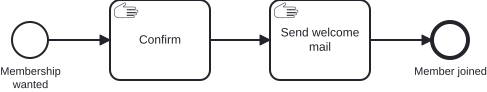

# Aufgabe 1 – Die Engine zum Laufen bringen

> **Voraussetzung:** Aufgabe 0 ist abgeschlossen (ein fachliches Modell liegt vor).
> **Arbeitsverzeichnis:** `services/process-application`
> **Neu in dieser Aufgabe:** CIB-Seven-Starter, Engine-Konfiguration, Auto-Deployment, Cockpit, `act_*`-Tabellen, Wait State.

## Darum geht es

In Aufgabe 0 hast du den Newsletter **fachlich** modelliert. Ein externer Consultant, mit dem
Miravelo zusammenarbeitet, hat daraus die **technisch fertige** Fassung gemacht – inklusive
einer kleinen Logik am Service Task „Send Welcome Mail": Er setzt per Inline-**Expression**
die Prozessvariable `welcomeMailSentTo`. Kein Java nötig; den echten Versand baust du später.

Was fehlt, ist die **Laufzeitumgebung**: ein Spring-Boot-Modul, in dem die CIB-Seven-Engine
läuft. Genau das richtest du jetzt ein – und lernst dabei Engine, Cockpit und Datenbank kennen.

## Lernziele

Nach dieser Aufgabe kannst du

- ein Spring-Boot-Modul mit eingebetteter CIB-Seven-Engine lauffähig machen,
- benennen, was die Engine zum Starten braucht (Datenbank, Auto-Configuration, Auto-Deployment),
- dich im Cockpit zwischen Processes, Tasklist und Admin bewegen,
- die Datenbank der Engine anbinden und die `act_*`-Tabellen den Kategorien Repository,
  Runtime und History zuordnen,
- am Datenbestand nachvollziehen, was eine laufende von einer beendeten Instanz unterscheidet,
- erklären, was ein **Wait State** ist und warum eine wartende Instanz einen Neustart übersteht,
- eine Prozessinstanz starten und einen User Task bearbeiten.

## Ziel-Modell



Das Modell ist bereits fertig und liegt unter
`services/process-application/src/main/resources/bpmn/newsletter.bpmn`. Du modellierst in
dieser Aufgabe nichts – du bringst es zum Laufen.

## Aufgabe

> Es geht ums **Einrichten und Kennenlernen** – kein Business-Code.

### 1. Datenbank starten

Die Engine speichert ihren gesamten Zustand in einer relationalen Datenbank – ohne sie
startet sie nicht. Fahre deshalb zuerst den Docker-Stack hoch; er bringt PostgreSQL und
MailHog (einen lokalen Mail-Server für später) mit:

```bash
cd stack && docker-compose up -d
```

### 2. Datenbankschema anlegen

Alle Module dieses Trainings teilen sich das Schema `exercise`. Lege es einmalig an – die
Engine legt zwar ihre Tabellen selbst an, das Schema muss aber vorhanden sein:

```bash
docker exec -i postgres psql -U admin -d cibseven-training < stack/init-schemas.sql
```

### 3. Dependencies aktivieren

Öffne `services/process-application/pom.xml` und kommentiere den Block `TODO Aufgabe 1` ein:
die beiden CIB-Seven-Starter (`webapp-4` und `rest-4`). Erst damit sind Engine,
Cockpit-Webapp und REST-API überhaupt im Modul. Die Versionen kommen zentral aus der
Root-`pom.xml` – trage sie also **ohne** `<version>` ein.

`spring-boot-starter-data-jpa` und der PostgreSQL-Treiber sind bereits aktiv.

### 4. Konfiguration aktivieren

Kommentiere in `services/process-application/src/main/resources/application.yaml` den Block
`TODO Aufgabe 1` ein: Datenbank-Anbindung, Cockpit-Admin-User und Webclient. Ohne
Datenbankverbindung startet die Engine nicht.

### 5. Anwendung scharf schalten

Aktiviere in `services/process-application/src/main/java/io/miragon/training/TrainingApplication.java`
die auskommentierten Imports und die Annotationen **`@SpringBootApplication`** und
**`@EnableJpaRepositories`**. Erst dadurch greifen Auto-Configuration und das automatische
BPMN-Deployment: Alle `*.bpmn` unter `src/main/resources` werden beim Start in die Engine
deployt.

### 6. Anwendung starten

Jetzt kommt alles zusammen: Spring Boot startet, die Auto-Configuration fährt die Engine
hoch, und die Engine deployt alle gefundenen BPMN-Dateien. Beobachte dabei das Log – es
zeigt dir genau diese Reihenfolge.

```bash
cd services/process-application && ../../mvnw spring-boot:run
```

### 7. Datenbank anbinden und die Tabellen der Engine ansehen

Beim ersten Start hat die Engine ihr komplettes Datenmodell selbst angelegt: mehrere Dutzend
Tabellen mit dem Präfix `act_`. Ein Blick darauf lohnt sich, weil du danach verstehst, was
die Engine überhaupt speichert – und wo du später bei Problemen nachschaust.

Binde die Datenbank mit einem Werkzeug deiner Wahl an. Zwei Wege:

- **In der IDE** (empfohlen, weil du sie über das ganze Training hinweg brauchst): In
  IntelliJ über *Database* → *+* → *Data Source* → *PostgreSQL* mit Host `localhost`,
  Port `5432`, Datenbank `cibseven-training`, Benutzer `admin`, Passwort `admin`. In
  VS Code leistet die Erweiterung *SQLTools* dasselbe.
- **Auf der Kommandozeile:**

  ```bash
  docker exec -it postgres psql -U admin -d cibseven-training
  ```

Sieh dir im Schema `exercise` an, welche Tabellen entstanden sind. Diese fünf sind für das
Training die wichtigsten:

| Tabelle | Präfix | Inhalt |
|---|---|---|
| `act_re_procdef` | `re` = Repository | deployte **Prozessdefinitionen** (`subscribeNewsletter`) |
| `act_ru_execution` | `ru` = Runtime | **laufende** Prozessinstanzen |
| `act_ru_task` | `ru` | offene **User Tasks** |
| `act_ru_variable` | `ru` | **Prozessvariablen** laufender Instanzen |
| `act_hi_procinst` | `hi` = History | **abgeschlossene** Prozessinstanzen |

Prüfe zum Einstieg, ob dein Modell wirklich deployt wurde:

```sql
SELECT key_, name_, version_ FROM exercise.act_re_procdef;
```

Die `act_ru_*`-Tabellen sind jetzt noch leer – es läuft ja noch nichts. Merke dir das, du
schaust gleich noch einmal hin.

### 8. Cockpit erkunden

Dieselben Daten gibt es auch mit Oberfläche: Das Cockpit ist die Weboberfläche der Engine
und dein wichtigstes Werkzeug für die kommenden Aufgaben.

Öffne [http://localhost:8080/webapp/#/seven/auth/start](http://localhost:8080/webapp/#/seven/auth/start) (admin / admin). Unter
**Processes** erscheint `Subscribe Newsletter`. Klick dich durch **Cockpit** (laufende
Instanzen), **Tasklist** (offene User Tasks) und **Admin** (Benutzerverwaltung).

### 9. Prozess durchspielen

Der Prozess ist deployt, aber noch nie gelaufen. Starte über die Tasklist eine Instanz und
führe sie von Hand bis zum Ende – so siehst du, wo die Instanz wartet und wo sie von allein
weiterläuft:

1. **Tasklist** → **Start process** → `Subscribe Newsletter`
2. **Filter anlegen (nur beim ersten Mal):** Die CIB-Seven-Tasklist zeigt offene Aufgaben nur
   über einen Filter an – solange keiner existiert, bleibt die Liste leer, obwohl deine Instanz
   bereits am User Task wartet. Klick oben links neben **Filters** auf das **+**
   („Create a filter"), vergib einen Namen (z. B. `Alle Aufgaben`) und speichere. Ab jetzt
   erscheinen die offenen Tasks.
3. Den User Task **„Fill out form"** öffnen, `email`, `name` und `age` ausfüllen, abschließen
4. Der Service Task setzt danach per Expression die Variable `welcomeMailSentTo`
5. Die Instanz ist am End Event „User subscribed" angekommen – in der History steht sie auf
   `COMPLETED`

### 10. Noch einmal in die Datenbank schauen

Jetzt wird interessant, was sich durch den Durchlauf verändert hat. Öffne dieselben Tabellen
wie in Schritt 7 erneut und vergleiche:

```sql
-- Laufende Instanzen und offene Tasks: wieder leer, die Instanz ist ja beendet
SELECT id_, proc_def_id_ FROM exercise.act_ru_execution;
SELECT id_, name_ FROM exercise.act_ru_task;

-- Die History hat dagegen alles mitgeschrieben
SELECT proc_def_key_, start_time_, end_time_, state_ FROM exercise.act_hi_procinst;
SELECT act_name_, act_type_ FROM exercise.act_hi_actinst ORDER BY start_time_;
SELECT name_, text_ FROM exercise.act_hi_varinst WHERE name_ = 'welcomeMailSentTo';
```

**Beobachte:** Während die Instanz am User Task wartete, standen Zeilen in `act_ru_execution`
und `act_ru_task`. Nach dem Abschluss sind die Runtime-Tabellen leer, und alles Gewesene
steht in den `act_hi_*`-Tabellen. Genau das ist der Unterschied zwischen `ru` und `hi`.

> **Begriff: Wait State.** Eine Stelle, an der die Prozessinstanz **stehen bleibt und auf
> ein Ereignis von außen wartet** – hier der User Task, der auf seinen Abschluss wartet.
> Die Engine schreibt den Zustand dabei in die `act_ru_*`-Tabellen und gibt den Thread
> frei. Deshalb übersteht eine wartende Instanz einen Neustart der Anwendung: Sie liegt
> nicht im Arbeitsspeicher, sondern in der Datenbank.
>
> Ein Service Task ist **kein** Wait State – er läuft durch, ohne auf etwas zu warten.
> Wait States sind neben dem User Task auch Timer, Message Events und (ab Aufgabe 9)
> External Tasks. Der Begriff begleitet dich durch das ganze Training: Er entscheidet, wo
> ein Prozess unterbrechbar ist und – ab [Aufgabe 4](exercise-04.md) – wo die Engine
> automatisch committet.

Probier das ruhig aus: Starte eine zweite Instanz und lass sie am User Task **stehen**. Jetzt
sind die Runtime-Tabellen gefüllt. Starte die Anwendung neu – die Instanz wartet danach
immer noch an derselben Stelle.

## Randbedingungen

- Du arbeitest ausschließlich im Modul `services/process-application`. Es ist das einzige
  Modul, in dem du alle Aufgaben bearbeitest.
- Das Modul enthält bereits das vollständige Skelett der hexagonalen Architektur. Die
  Business-Schicht (Services, REST-Controller, Delegates, Prozess-Adapter) ist mit
  `TODO Aufgabe 2` auskommentiert und wird hier noch nicht gebraucht.
- Alle Module laufen auf Port `8080` und im Schema `exercise`. Starte immer nur eines.

## Erwartetes Ergebnis

Im Log erscheinen `Auto-Deploying resources: [... newsletter.bpmn]` und
`Started TrainingApplication`. Das Cockpit ist erreichbar, `Subscribe Newsletter` steht
unter **Processes**, und eine von dir gestartete Instanz läuft bis zum End Event durch.

## Selbstcheck

- [ ] PostgreSQL läuft, das Schema `exercise` existiert
- [ ] Dependencies, Konfiguration und `@SpringBootApplication` sind aktiviert
- [ ] Die Anwendung startet und deployt `newsletter.bpmn`
- [ ] `Subscribe Newsletter` erscheint im Cockpit unter **Processes**
- [ ] Eine Instanz wurde gestartet, der User Task bearbeitet, der Prozess sauber beendet
- [ ] Die Datenbank ist in deinem Werkzeug angebunden, `act_re_procdef` enthält
      `subscribeNewsletter`
- [ ] Du kannst erklären, warum die `act_ru_*`-Tabellen nach dem Durchlauf leer sind und
      was stattdessen in den `act_hi_*`-Tabellen steht
- [ ] Du kannst in eigenen Worten sagen, was ein Wait State ist und welches Element im
      Modell einer ist

## Hinweise

- Startet die Anwendung mit einem Fehler zur Datenbank, prüfe zuerst Schritt 2: Ohne das
  Schema `exercise` findet weder Hibernate noch die Engine ihre Tabellen.
- Die Präfixe der Engine-Tabellen sind ein nützlicher Merkanker: `re` liegt fest, `ru`
  bewegt sich, `hi` ist Vergangenheit.

## Referenzlösung

- Fertiges Modul: `../solutions/exercise-01/`
- Modell: `../models/exercise-01/newsletter.bpmn`
- Direkt ins Arbeitsmodul laden (ersetzt `src/main` inklusive `application.yaml`; die
  `pom.xml` und damit deine Dependencies aus Schritt 3 bleiben bestehen):

  ```bash
  ./mvnw -pl services/process-application antrun:run@load-solution -Dsolution=01
  ```

## Nächster Schritt

In Aufgabe 2 übernimmst du die technische Modellierung selbst und verbindest den Service
Task mit echtem Java-Code.

➡️ [Weiter zu Aufgabe 2](exercise-02.md)
