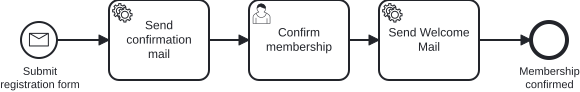

# Aufgabe 4 – Membership & Kapazitätsprüfung

## Ziel-Modell



## Lernziele

- Domain-Konzepte umbenennen (Refactoring)
- Exclusive Gateway modellieren und implementieren
- Neuen Service Task (Kapazitätsprüfung) hinzufügen
- Alternativen Prozessausgang implementieren
- Business Key setzen und Prozessinstanzen fachlich zuordnen
- User Task mit einem generierten Task-Formular ausstatten (Review & Approve im Cockpit)

## Hintergrund

**Strategie-Meeting. Freitagnachmittag. Jemand hat exklusiven Matcha Latte mitgebracht.**

Miravelo startet den **Miravelo Inner Circle** – eine limitierte, exklusive Membership
für echte Fans der Marke. Gravel Bike im Keller, Rennrad an der Wand – du weißt, wen wir meinen.

Tausend Plätze. Zählt bis tausend. Das ist die Kapazität.

Warum tausend? Weil Knappheit Wert erzeugt. Weil FOMO ein Business-Modell ist. Weil irgendjemand
ein Buch über Luxusmarken gelesen hat und jetzt „Premium Positioning" in jeden Satz einbaut.

> *„Wir sind nicht exklusiv weil wir gut sind. Wir sind exklusiv weil wir nur tausend Plätze
> haben und der Counter in der Datenbank auf 1000 steht."*
> — Ehrlichster Kommentar im Sprint Planning

Das Gute daran: Aus Prozesssicht brauchen wir ein **Gateway**. Der gnadenlose Türsteher im
Prozessfluss. Hat die Person einen Platz bekommen? Herzlichen Glückwunsch, weiter. Kein Platz?
Ablehnungsmail. Kein Einspruch. Das Gateway entscheidet.

Mit 27 eine Absage vom Fahrradladen des Vertrauens zu bekommen trifft anders. Aber das ist
jetzt das Problem der Bewerber, nicht deins.

Und wenn wir schon echte Mitgliedschaften verwalten: Jede Anmeldung ist ab jetzt ein
handfestes fachliches Objekt mit einer eigenen ID. Genau die wollen wir auch im Cockpit
wiederfinden. Deshalb bekommt jede Prozessinstanz in dieser Aufgabe einen **Business Key** –
die `membershipId`. Kein „welche der 40 laufenden Instanzen war nochmal Carol?" mehr, sondern
eine Instanz, die eindeutig ihrer Anmeldung zugeordnet ist.

> **Hinweis:** In dieser Aufgabe findet ein Domain-Refactoring statt. Bisher war die Domäne
> eine einfache Newsletter-Subscription. Ab jetzt wird daraus eine **Membership** im
> Miravelo Inner Circle. Benenne die bestehenden Klassen entsprechend um
> (z.B. `Subscription` → `Membership`, `SubscriptionId` → `MembershipId`, etc.).

### Neuer Prozessablauf

```
[Submit registration form]
         ↓
[Claim membership]         ← NEU (Service Task)
         ↓
[Has empty spots?]         ← NEU (Exclusive Gateway)
   ↓ Yes              ↓ No
[Send confirmation]   [Send rejection mail]  ← NEU
         ↓                    ↓
[Confirm membership]  [Membership rejected]  ← NEU End Event
         ↓
[Send Welcome Mail]
         ↓
[Membership confirmed]
```

## Aufgaben

### 1. BPMN komplett neu modellieren

Erstelle den Prozess nach dem Referenz-Modell `../models/exercise-04/newsletter.bpmn`.

Neue Elemente:

| Element | Typ | ID | Name | Konfiguration |
|---|---|---|---|---|
| Claim | Service Task | `serviceTask_claimMembership` | Claim membership | `#{claimMembershipDelegate}` |
| Gateway | Exclusive Gateway | `gateway_hasEmptySpots` | Has empty spots? | Default-Flow: `Yes`-Pfad |
| Rejection Mail | Service Task | `serviceTask_sendRejectionMail` | Send rejection mail | `#{sendRejectionMailDelegate}` |
| Abgelehnt | End Event | `endEvent_membershipRejected` | Membership rejected | – |

**Gateway-Bedingung (Nein-Pfad):** `${!hasEmptySpots}`

### 2. Domain erweitern: `MembershipCapacity`

**Neue Datei:** `domain/MembershipCapacity.java`

Erstelle eine Klasse `MembershipCapacity` mit folgenden Eigenschaften:
- `maxSpots` (int, Default: 1000) – maximale Anzahl verfügbarer Plätze
- `claimedSpots` (int, Default: 0) – aktuell belegte Plätze
- `hasEmptySpots` – gibt `true` zurück, wenn `claimedSpots < maxSpots`
- `claim()` – erhöht `claimedSpots` um 1

### 3. Use Cases und Services erstellen

Erstelle nach dem bewährten Muster (analog zu Aufgabe 3):

- `ClaimMembershipUseCase` / `ClaimMembershipService`
  - Prüft Kapazität (einfacher Counter in Memory reicht)
  - Setzt Prozessvariable `hasEmptySpots` (via `DelegateExecution.setVariable(...)`)
- `SendRejectionMailUseCase` / `SendRejectionMailService`
  - Loggt "Sending rejection mail to [email]"

### 4. Delegates erstellen

- `ClaimMembershipDelegate`: Prüft Kapazität, setzt Variable `hasEmptySpots` auf der `DelegateExecution`
- `SendRejectionMailDelegate`: Liest `membershipId`, ruft Use Case auf

**Hinweis:** Die Element-IDs und Variablennamen (z.B. `hasEmptySpots`) kannst du direkt aus dem BPMN-Modell entnehmen.

### 5. Transaktionsgrenzen setzen (Pflicht)

> Theorie dazu: Trainingskapitel **„Async & Transaction Boundaries"** (Topic 4, *Execution Resilience*) – Save Points, Default- vs. manuelle Grenzen, Rollback in Aktion. Hier ist die erste Stelle, an der wir es **anwenden**.

Bis hierher (Aufgabe 1–3) lief der Prozess komplett **synchron**. Ab diesem Modell setzt du die ersten **Transaktionsgrenzen** – in zwei Stufen.

**a) Wait-State-Grenzen (Basis).** Die Engine committet automatisch an jedem Wait State; ergänze die manuellen Continuations, die sonst fehlen:
- `asyncBefore` am **Message-Start-Event** `startEvent_submitRegistration` – saubere TX-Grenze nach der Message-Korrelation; der `correlateMessage`-Aufruf legt nur die Instanz an und kehrt zurück.
- `asyncAfter` an jedem **User Task** (`userTask_confirmMembership`) – die Completion committet sofort. Sonst laufen Completion **und** der nachgelagerte Service Task in **einer** Transaktion: wirft er, rollt die Completion mit zurück und der Task erscheint wieder in der Tasklist.

**b) Service-Task-Grenzen (der neue Fall).** Mit `claimMembership` steht erstmals ein **nicht wiederholbarer** Schritt (die Platz-Reservierung) direkt vor dem Mailversand. Zwischen Message-Start und User Task liegt **kein** Wait State – ohne weitere Marker laufen `claimMembership` **und** `sendConfirmationMail` deshalb in **einer** Engine-Transaktion.

Wirft der Mailversand eine Exception, rollt die Engine die *gesamte* Transaktion zurück und führt den Continuation-Job erneut aus. Ergebnis: `claimMembership` läuft **ein zweites Mal** – ein doppelt reservierter Platz, obwohl fachlich nur der Mailversand fehlschlug.

**Regel:** Trenne die *nicht wiederholbare* Arbeit vom *externen, nicht zurückrollbaren* Effekt mit einer eigenen Transaktionsgrenze. Setze `asyncBefore` an jeden Service Task, der einen externen Effekt (Mailversand) auslöst:

| Marker | Element | Warum |
|---|---|---|
| `asyncBefore` | `serviceTask_sendConfirmationMail` | committet die Reservierung zuerst; ein Mail-Fehler wiederholt nur den Versand, nicht den Claim |
| `asyncBefore` | `serviceTask_sendRejectionMail` | dito – liegt sonst in derselben TX wie `claimMembership` |
| `asyncBefore` | `serviceTask_sendWelcomeMail` | Konsistenz (externer Effekt); ab Aufgabe 6 zusätzlich auf einem Parallel-Zweig relevant |

`claimMembership` bekommt bewusst **keinen** Marker – es soll früh, gemeinsam mit dem Token-Fortschritt, committen. Der Marker gehört auf den *nachgelagerten* Aufruf, der die Reservierung sonst mit zurückrollt. Im Modeler: Element selektieren → Properties Panel → „Asynchronous Before".

> **Idempotenz-Merksatz:** Ein Retry darf einen Service Task erneut ausführen. Sobald eine Aktion nur *einmal* passieren darf (Reservierung, Zahlung), muss sie entweder vor der Grenze committen oder idempotent sein. Bei externen Schnittstellen (Aufgabe 9, external tasks in [Extra-Task 1](extra-task-1.md)) taucht dasselbe Muster wieder auf.

### 6. Business Key setzen

Bislang starten wir den Prozess ohne fachliche Kennung – im Cockpit sind die Instanzen
nur über ihre technische ID unterscheidbar. Setze deshalb beim Start des Prozesses einen
**Business Key**. Verwende dafür die `membershipId` (die ID der Anmeldung).

**Warum?** Der Business Key verknüpft die Prozessinstanz mit dem fachlichen Objekt. So
lässt sich jede Instanz im Cockpit eindeutig einer Anmeldung zuordnen, gezielt suchen und
später fachlich korrelieren.

**Wo?** Dort, wo der Prozess gestartet wird (`MembershipProcessAdapter`). Der Message-
Correlation-Builder bietet dafür `processInstanceBusinessKey(...)`:

```java
runtimeService.createMessageCorrelation("Message_SubscriptionRequested")
        .processInstanceBusinessKey(membership.id().value().toString())
        .setVariables(...)
        .correlateStartMessage();
```

### 7. Task-Formular für den Confirm-Task (Review & Approve)

Der User Task `userTask_confirmMembership` ist bisher eine Blackbox: Wer ihn im Cockpit
bzw. in der Tasklist öffnet, sieht nur einen leeren Task und kann ihn blind abschließen.
Für einen echten Freigabe-Schritt fehlt der Kontext. Gib dem Task deshalb ein
**generiertes Task-Formular** – so sieht die freigebende Person die Anmeldedaten und kann
die Mitgliedschaft bewusst bestätigen (approven).

**Was?** Ein Formular mit vier Feldern:

| Feld-ID | Label | Typ | Zweck |
|---|---|---|---|
| `name` | Name | string | Kontext (wird aus der Prozessvariable vorbefüllt) |
| `email` | E-Mail | string | Kontext (vorbefüllt) |
| `age` | Age | long | Kontext (vorbefüllt) |
| `confirmed` | Confirm membership | boolean | Die eigentliche Freigabe (Checkbox) |

Die Felder `name`, `email` und `age` tragen dieselben IDs wie die beim Prozessstart
gesetzten Prozessvariablen und werden dadurch in der Tasklist **automatisch vorbefüllt**.
`confirmed` ist neu und wird beim Abschließen des Tasks als boolesche Prozessvariable
gespeichert (Review & Approve).

**Wie?** Es handelt sich um ein *Generated Task Form* (Camunda-7-Bordmittel – keine
zusätzliche Datei, kein HTML nötig). Im Camunda Modeler: User Task auswählen →
Properties Panel → Abschnitt **Forms** → Form-Felder anlegen. Im BPMN-XML entsteht dabei
ein `extensionElements`-Block direkt im User Task:

```xml
<bpmn:userTask id="userTask_confirmMembership" name="Confirm membership" camunda:asyncAfter="true">
  <bpmn:extensionElements>
    <camunda:formData>
      <camunda:formField id="name" label="Name" type="string" />
      <camunda:formField id="email" label="E-Mail" type="string" />
      <camunda:formField id="age" label="Age" type="long" />
      <camunda:formField id="confirmed" label="Confirm membership" type="boolean" />
    </camunda:formData>
  </bpmn:extensionElements>
  <bpmn:incoming>...</bpmn:incoming>
  <bpmn:outgoing>...</bpmn:outgoing>
</bpmn:userTask>
```

> **Hinweis:** Der Feldtyp muss zum Typ der Prozessvariable passen, damit die Vorbefüllung
> greift (`age` ist `long`, nicht `string`). Das Feld `confirmed` steuert in dieser Aufgabe
> noch keinen Prozessfluss – es wird lediglich als Variable erfasst. Ein Muster für das
> gleiche `formData`/`formField`-Konstrukt findest du am Task `userTask_fillOutForm`.

## Testen

**Happy Path (Kapazität vorhanden):**
```bash
curl -X POST http://localhost:8080/api/memberships \
  -d '{"email": "carol@miravelo.com", "name": "Carol", "age": 27}'
```

Öffne anschließend in der **Tasklist** (`http://localhost:8080/camunda`, admin/admin) den
Task `Confirm membership`: Name, E-Mail und Age sind bereits vorbefüllt. Setze den Haken bei
**Confirm membership** und schließe den Task ab – der Prozess läuft weiter zu *Send Welcome
Mail* und die Variable `confirmed` steht in der History auf `true`.

**Rejection Path (Kapazität auf 0 setzen → Anwendungs-Config anpassen):**
```bash
# Setze maxSpots = 0 in der Konfiguration
curl -X POST http://localhost:8080/api/memberships \
  -d '{"email": "dave@miravelo.com", "name": "Dave", "age": 30}'
# Erwartetes Log: "Sending rejection mail to dave@miravelo.com"
```

## Referenzlösung

`../solutions/exercise-04/`

---

➡️ [Weiter zu Aufgabe 5](exercise-05.md)
