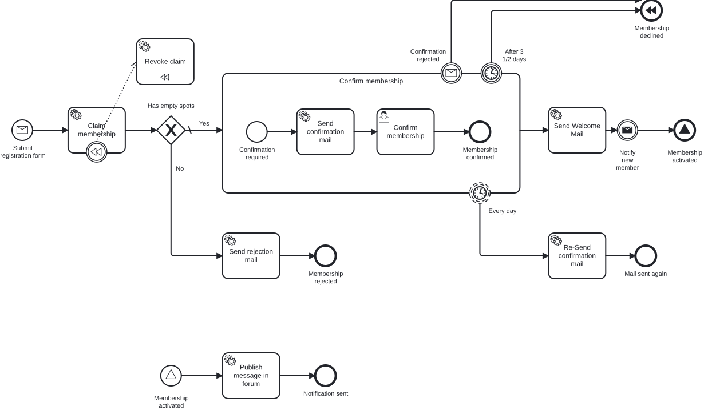

# Aufgabe 8 – Signal Events & Kompensation (SAGA-Muster)

## Ziel-Modell



## Lernziele

- Signal End Events und Signal Start Events verstehen und einsetzen
- Signale innerhalb eines Prozessmodells verwenden
- Outbound Port für externe Kommunikation einführen
- Abgeschlossene Aktionen bei Abbruch automatisch rückgängig machen (BPMN-Kompensation)
- SAGA-Muster in Prozessmodellen anwenden

## Hintergrund

### Signal Events

Wenn jemand seine Membership erfolgreich aktiviert, dann ist das ein echtes Highlight! 🎉
Wir haben jemanden auf seiner Reise durch die Quarterlife Crisis für Miravelo gewonnen – das verdient Aufmerksamkeit!

Das Team will diese Erfolgsmomente feiern: Eine Nachricht im Community-Forum posten, eine Benachrichtigung an Slack senden, vielleicht sogar einen Webhook triggern. Denn jede aktivierte Membership ist ein Beweis, dass unser Konzept funktioniert.

Technisch lösen wir das mit einem **Signal Event**: Sobald die Membership aktiviert wird, feuert ein Signal End Event. Dieses Signal wird im selben Prozessmodell durch einen separaten Prozess mit Signal Start Event aufgefangen – und dort starten wir die Benachrichtigungen.

```
...
[Send Welcome Mail]
        ↓
[Membership activated]     ← Signal End Event (wirft: Signal_membershipActivated)

                ↓ (wird empfangen durch)

[Membership activated]     ← Signal Start Event (empfängt: Signal_membershipActivated)
        ↓
[Publish message in forum] ← Service Task
        ↓
[Done]
```

### Kompensation

Erinnerst du dich an `revokeClaim`? In Aufgabe 7 haben wir den Service Task eingeführt, um den Membership-Platz bei Ablehnung oder Timeout wieder freizugeben – als expliziter Knoten direkt im Sequenzfluss. Damals: pragmatisch. Heute: nicht mehr zeitgemäß.

Statt den `revokeClaim` weiterhin als expliziten Service Task an jeden Decline-Pfad zu hängen, nutzen wir **BPMN-Kompensation**. Der Prozess deklariert einmal, *welche Aktion* (`revokeClaim`) *welche andere Aktion* (`claimMembership`) rückgängig macht. Sobald ein Compensating End Event erreicht wird, kümmert sich die Engine um den Rest.

**Warum ist das besser?** Bei mehreren abzusichernden Aktionen (z.B. claimMembership + sendConfirmationMail + Drittdienste) wächst der manuelle Kompensierungspfad schnell und wird schwer wartbar. Mit BPMN-Kompensation deklariert man die Zuordnung einmal – und die Engine übernimmt die Ausführung automatisch.

```
serviceTask_claimMembership ──── [Kompensations-Boundary] ──── serviceTask_revokeClaim
                                                                (isForCompensation=true)
endEvent_membershipDeclined  →  [Compensating End Event]  →  Engine ruft revokeClaim auf
```

## Aufgaben

### 1. BPMN erweitern – Signal Events

Erweitere den Prozess nach `../models/exercise-08/newsletter.bpmn`.

**Änderungen:**

1. End Event `endEvent_membershipActivated` → **Signal End Event**
   - Signal Name: `Signal_membershipActivated`

2. Neuer **Top-Level Signal Start Event** (außerhalb des Hauptflusses, aber im selben Pool):
   - ID: `startEvent_membershipActivated`
   - Name: `Membership activated`
   - Signal: `Signal_membershipActivated`

3. Neuer Service Task nach dem Signal Start Event:
   - ID: `serviceTask_publishSignal`
   - Name: `Publish message in forum`
   - Delegate Expression: `#{notifyAboutSignedMembershipDelegate}`

### 2. Outbound Port erstellen

**Neue Datei:** `application/port/outbound/MembershipEventPublisher.java`

Erstelle ein Interface mit einer Methode `publishMembershipActivated(MembershipId membershipId)`.

### 3. Use Case und Service

**`NotifyAboutSignedMembershipUseCase`** / **`NotifyAboutSignedMembershipService`**:

Lade die Membership aus dem Repository und publiziere das Event über den `MembershipEventPublisher`.

### 4. Publisher-Adapter implementieren

**Neue Datei:** `adapter/outbound/MembershipEventPublisherAdapter.java`

Implementiere das `MembershipEventPublisher`-Interface. Für den Moment reicht ein einfaches Logging – z.B. `"EVENT: MembershipActivated(id=...)"`. Später könnte hier ein HTTP-Webhook oder Kafka-Event angebunden werden.

### 5. `NotifyAboutSignedMembershipDelegate` erstellen

Analog zu bisherigen Delegates, ruft `NotifyAboutSignedMembershipUseCase` auf.

> Async-Continuations (siehe Aufgabe 3): Setze `asyncBefore` auch am neuen Signal-Start-Event `startEvent_membershipActivated` – Signal-Korrelation soll nicht im Caller-TX laufen.

### 6. BPMN anpassen – Kompensation

Ändere `newsletter.bpmn` im Miragon BPMN Modeler:

- [ ] Compensation Boundary Event an `serviceTask_claimMembership` anhängen
- [ ] `serviceTask_revokeClaim` mit `isForCompensation=true` markieren und per Association mit dem Boundary verknüpfen
- [ ] Decline-Pfade direkt mit `endEvent_membershipDeclined` verbinden (kein `revokeClaim` im Pfad)
- [ ] `endEvent_membershipDeclined` in Compensating End Event umwandeln

Referenz-Modell für die Kompensation: `../models/exercise-09/newsletter.bpmn`

**Hinweis:** Der `RevokeClaimDelegate` bleibt unverändert – er wird jetzt nur anders aufgerufen (durch die BPMN-Engine statt via Sequenzfluss). Es muss kein Java-Code geändert werden.

**Kontrollfrage:** Warum funktioniert `RevokeClaimDelegate` ohne Änderungen weiter, obwohl er nicht mehr im Sequenzfluss liegt?

## Testen

**Signal Event prüfen:**

```bash
MEMBERSHIP_ID=$(curl -s -X POST http://localhost:8080/api/memberships \
  -d '{"email": "frank@miravelo.com", "name": "Frank", "age": 29}')
```

Im Cockpit:
1. UserTask `Confirm membership` erscheint
2. Task abschließen
3. Im Log erscheint: `EVENT: MembershipActivated(id=...)`

**Kompensation prüfen – Timer-Ablauf:**
1. `POST /api/memberships` → Prozess startet, Claim wird gesetzt
2. Warte bis Timer-Boundary ausgelöst wird (z.B. Timer-Konfiguration auf 30s für den Test setzen)
3. Log zeigt `"Revoking membership claim"` – obwohl kein expliziter Service Task im Pfad
4. Cockpit: Prozessinstanz endet mit „Membership declined"

**Kompensation prüfen – Manuelle Ablehnung:**
1. `POST /api/memberships` → warte auf UserTask `confirmMembership`
2. Trigger Confirmation-Rejected-Message → `event_confirmationRejected` Boundary löst aus
3. Pfad geht direkt zu `endEvent_membershipDeclined` → Compensation feuert → `revokeClaim` automatisch ausgeführt

## Kontrolle

- [ ] Im Log erscheint `EVENT: MembershipActivated(id=...)` nach erfolgreicher Membership
- [ ] Log zeigt `"Revoking membership claim"` beim Timer-Ablauf (ohne expliziten Task im Pfad)
- [ ] Log zeigt `"Revoking membership claim"` nach Ablehnung via Message
- [ ] Cockpit: Kompensations-Handler wird in der Prozesshistorie sichtbar
- [ ] `revokeClaim` ist **nirgendwo** mehr im Sequenzfluss – nur noch als Compensation Handler

## Prozess-Test erweitern

**Signal:** Der Happy Path endet jetzt an `endEvent_membershipActivated`, das ein Signal wirft und
darüber eine zweite, unabhängige Instanz startet. Treibe im Happy Path nur die **ursprüngliche**
Instanz weiter – nutze `continueToNextWaitState(processEngine, instance.getProcessInstanceId())`.
Weise den Signal-Broadcast nach, indem du prüfst, dass nach Abschluss genau **eine** weitere
Prozessinstanz läuft (`runtimeService.createProcessInstanceQuery()…count()`), und räume laufende
Instanzen in `@AfterEach` auf.

> **Hinweis:** Die Signal-Instanz trägt die `membershipId` nicht mit (globale Signale übertragen
> keine Variablen). Deshalb wird sie im Test bewusst nicht bis zum `publishSignal`-Delegate getrieben.

**Kompensation:** Fachlich ändert sich am Ergebnis der Decline-Pfade nichts – `serviceTask_revokeClaim`
läuft weiterhin, nur jetzt als Kompensations-Handler. Deine bestehenden Assertions
`hasPassed(Elements.SERVICE_TASK_REVOKE_CLAIM.getValue(), Elements.END_EVENT_MEMBERSHIP_DECLINED.getValue())`
und `verify(revokeClaimUseCase).revokeClaim(id)` gelten unverändert.

> **Weiterführendes:** BPMN-Kompensation eignet sich besonders für **SAGA-Muster** in Microservices: Jeder Schritt hat einen zugehörigen Kompensationsschritt. Bei Fehlern kompensiert die Engine alle bisher erfolgreichen Schritte in umgekehrter Reihenfolge. In CIB Seven kann Kompensation auch über Subprocess-Grenzen hinweg ausgelöst werden.

## Referenzlösung

`../solutions/exercise-08/`

---

➡️ [Weiter zu Aufgabe 9](exercise-09.md)
