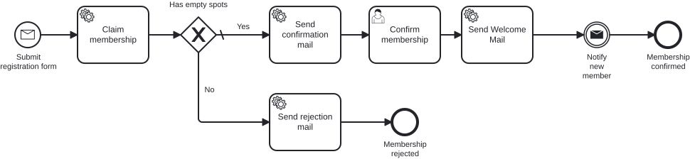
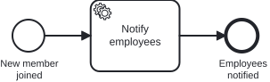

# Aufgabe 6 – Remote Engine & External Task

## Ziel-Modell

Hauptprozess mit dem neuen Message Throw Event `throw_notifyNewMember`:



Der zweite Prozess `employeeNotification` mit dem External Service Task:



Referenz-Modelle: `../models/exercise-06/newsletter.bpmn` (Hauptprozess) und
`../models/exercise-06/employee-notification.bpmn` (Benachrichtigungs-Prozess).

## Lernziele

- Message **Throw Event** (per Delegate) einsetzen, um einen **zweiten Prozess** zu starten
- **External Service Task** (`camunda:type="external"` + Topic) modellieren
- Einen **External Task Worker** in einem **eigenen Service** (eigene JVM) bauen, der sich
  über die **REST-API** mit der Engine verbindet (Remote Engine)
- Aus dem Worker einen echten **Web-Service** aufrufen (Nachricht in einen Microsoft-Teams-Kanal posten)

## Hintergrund

Miravelo wächst – und jedes Mal, wenn jemand dem **Inner Circle** beitritt, sollen es *alle*
mitbekommen. Bisher endet der Prozess still mit „Membership confirmed". Jetzt soll er, sobald ein
Mitglied bestätigt ist, eine Nachricht **werfen**, die einen zweiten, eigenständigen
**Benachrichtigungs-Prozess** startet. 

Dessen einzige Aufgabe (ein External Service Task) wird nicht mehr von einem Delegate in der Engine erledigt, sondern von einem **separaten Worker-Service**, der die Engine nur über deren REST-API kennt – das klassische **External-Task-Pattern**.

Der Worker postet jeden neuen Member als **Karte in einen gemeinsamen Microsoft-Teams-Kanal**,
den das ganze Team mitliest. Jeder sieht die neuen Mitglieder in Echtzeit im Kanal auftauchen –
unser öffentliches Erfolgserlebnis. 🎉

### Warum eine Remote Engine – und keine embedded?

Bisher lief die Engine **embedded** – mitten in der Prozess-Anwendung. Hier machen wir es bewusst
anders: Der Notification-Worker **betreibt keine eigene Engine**, er **nutzt** nur die fremde – über
REST. Genau das meint **„Remote Engine"**: die Engine läuft woanders, unser Service klopft nur an.

Warum der Aufwand? Weil so ein Schnitt eine **Architektur-Entscheidung nach den Eigenschaften des
Service** ist, kein Selbstzweck. Spielen wir es an einem – zugegeben etwas überspitzten – Szenario durch:

- **Skalierung:** Die Prozess-Anwendung stemmt alle Anmeldungen und darf ordentlich hochskalieren.
  Der Worker tuckert dagegen gemütlich vor sich hin – ein neues Mitglied alle paar Minuten. Den
  wollen wir **deutlich schwächer skalieren** (eine Instanz reicht), statt in jeder Kopie eine ganze
  Engine mitzuschleppen.
- **Security:** In diesem Service steckt eine **Webhook-URL mit Secret** (die Signatur ist quasi ein
  Passwort). Solche Geheimnisse **isoliert** man lieber in einem kleinen, streng abgesicherten
  Service – nicht in der breit ausgerollten Prozess-Anwendung, wo die Angriffsfläche riesig ist.

**Unterschiedliche Charakteristiken → unterschiedliche Services.** Die Engine bleibt in der
Prozess-Anwendung; unser Worker redet nur höflich per REST mit ihr.

### Neuer Prozessablauf

```
Hauptprozess (subscribeNewsletter):
  ... → [Send Welcome Mail] → (⨯ Throw: Notify new member) → [Membership confirmed]
                                        │  #{notifyNewMemberDelegate}
                                        ▼  startet
Zweiter Prozess (employeeNotification):
  (Start) → [Notify employees]   → (End)
             external, topic="notifyEmployees"
                     ▲
                     │ fetch & lock, complete
        Worker-Service (eigene JVM):  NotifyEmployeesHandler → RestClient → Teams-Kanal
```

## Architektur

Es kommen **zwei Dinge** dazu:

1. **Hauptservice** (das `services/process-application`-Modul): ein Message-Throw-Event + ein zweiter
   Prozess (`employeeNotification`) mit einem External Service Task.
2. **Worker-Service** (neues Modul `services/notification-service`): ein eigenständiger Spring-Boot-Prozess
   **ohne eigene Engine**, der sich per External Task Client remote an `http://localhost:8080/engine-rest`
   hängt und den Topic `notifyEmployees` abarbeitet. Über den Out-Port `NotificationPublisherOutPort`
   postet der `MicrosoftTeamsMessagePublisher` eine **Adaptive Card** in einen Microsoft-Teams-Kanal.

## Aufgaben

### Teil A – Hauptservice

#### 1. Zweiten Prozess `employee-notification.bpmn` anlegen

Ein einfacher One-Tasker unter `src/main/resources/bpmn/employee-notification.bpmn`:

- Prozess-ID `employeeNotification`, `isExecutable="true"`, `camunda:historyTimeToLive="180"`
- `Start` → **Service Task** `serviceTask_notifyEmployees` → `End`
- Der Service Task ist ein **External Task**:
  ```xml
  <bpmn:serviceTask id="serviceTask_notifyEmployees" name="Notify employees"
                    camunda:type="external" camunda:topic="notifyEmployees" />
  ```

#### 2. Message Throw Event im Hauptprozess ergänzen

Im `newsletter.bpmn` auf dem Confirmed-Pfad – nach `serviceTask_sendWelcomeMail`, vor dem
Confirmed-End-Event – ein **Message Intermediate Throw Event** einfügen, das per Delegate den
zweiten Prozess startet:

```xml
<bpmn:intermediateThrowEvent id="throw_notifyNewMember" name="Notify new member">
  <bpmn:messageEventDefinition messageRef="Message_NewMemberJoined"
      camunda:delegateExpression="#{notifyNewMemberDelegate}" />
</bpmn:intermediateThrowEvent>
```

(plus die `bpmn:message`-Deklaration `Message_NewMemberJoined`).

#### 3. Delegate, Use Case, Service & Outbound-Adapter

Nach dem bekannten Muster (Delegate → Use Case → Service → Outbound-Port → Adapter):

- `adapter/inbound/cibseven/NotifyNewMemberDelegate` (extends `BaseDelegate`) – liest `name` und
  `email` aus der Execution, ruft `StartEmployeeNotificationUseCase`.
- `application/port/inbound/StartEmployeeNotificationUseCase` (+ `Command`-Record).
- `application/service/StartEmployeeNotificationService`.
- `application/port/outbound/EmployeeNotificationProcess`.
- `adapter/outbound/cibseven/EmployeeNotificationProcessAdapter` – startet den zweiten Prozess:
  ```java
  runtimeService.startProcessInstanceByKey(
      EmployeeNotificationProcessApi.PROCESS_ID.getValue(),
      Map.of("name", memberName, "email", memberEmail));
  ```

> Die typsichere `EmployeeNotificationProcessApi` wird beim Build aus der neuen BPMN generiert
> (bpmn-to-code, siehe [Aufgabe 5 · Add-on](exercise-5-addon.md)).

### Teil B – Worker-Service (`services/notification-service`)

Im Worker-Modul `services/notification-service/` implementierst du nur den **Handler** (den „Delegate"
des Workers) und den **Service**. Der Teams-Adapter `MicrosoftTeamsMessagePublisher` ist bereits
**vorgegeben** – der Adaptive-Card-Aufbau und der REST-Call sind Infrastruktur, kein Lernziel.

#### 4. External Task Handler abonnieren (der „Delegate")

`adapter/inbound/cibseven/NotifyEmployeesHandler` implementiert `ExternalTaskHandler` und
abonniert den Topic:

```java
@Component
@ExternalTaskSubscription(topicName = "notifyEmployees")
public class NotifyEmployeesHandler implements ExternalTaskHandler {
    public void execute(ExternalTask task, ExternalTaskService taskService) {
        String name = task.getVariable("name");
        publishNotification.publish(new Notification(
                "Miravelo Inner Circle", "🎉 New Inner Circle member: " + name + "!"));
        taskService.complete(task);   // Task abschließen!
    }
}
```

Der Handler übersetzt das External-Task-Event in ein Domain-Objekt **`Notification`** (Titel + Text)
und gibt es an den Use Case `PublishNotificationUseCase` weiter – **nicht** den Member selbst.

#### 5. Service implementieren

`application/service/PublishNotificationService` (implementiert `PublishNotificationUseCase`) reicht
die `Notification` an den Out-Port weiter:

```java
public void publish(Notification notification) {
    notificationPublisher.publish(notification);   // NotificationPublisherOutPort
}
```

> Der Out-Port `NotificationPublisherOutPort` und seine Implementierung
> `MicrosoftTeamsMessagePublisher` (der Teams-Adapter) sind schon da – du rufst sie nur auf.

Die Verbindung zur Remote Engine und die Ziel-URL stehen in `application.yaml`:

```yaml
camunda:
  bpm:
    client:
      base-url: http://localhost:8080/engine-rest   # Remote Engine REST-API
notification:
  teams:
    # Echte URL per Umgebungsvariable TEAMS_WEBHOOK_URL – kein Secret ins Repo committen.
    webhook-url: ${TEAMS_WEBHOOK_URL:https://CHANGE-ME}
```

## Teams-Webhook einrichten (Power Automate „Workflows")

1. In Teams beim Ziel-**Kanal** auf **••• → Workflows** (oder die **Workflows**-App → **Neuer Flow**).
2. Vorlage **„Post to a channel when a webhook request is received"** wählen (Trigger
   „When a Teams webhook request is received"), Teams-Verbindung bestätigen.
3. **Team** + **Kanal** auswählen → **Erstellen**. Es entsteht eine **HTTP-POST-URL** (`https://…`).
4. Diese URL beim Start des Workers als Umgebungsvariable übergeben:
   `TEAMS_WEBHOOK_URL='<deine-URL>'` (oder Argument `--notification.teams.webhook-url=<URL>`).

> ⚠️ Die Signatur (`sig=…`) in der URL ist ein **Secret** – nicht ins Repo committen. Den alten
> „Incoming Webhook"-Connector **nicht** verwenden (2026 abgeschaltet). Der Kanal ist nur für
> Team-Mitglieder sichtbar. Da die Ausgabe hinter dem Out-Port `NotificationPublisherOutPort` steckt, lässt
> sich statt Teams leicht ein anderer Web-Service anbinden.

## Testen

```bash
# 1. Stack + Hauptservice (Port 8080) starten
cd stack && docker-compose up -d
cd ../solutions/exercise-06/process-application && ../../../mvnw spring-boot:run

# 2. Worker mit deiner Teams-Webhook-URL starten (eigenes Terminal)
cd solutions/exercise-06/notification-service
TEAMS_WEBHOOK_URL='<deine-Teams-Webhook-URL>' ../../../mvnw spring-boot:run

# 3. Membership anlegen und im Cockpit (http://localhost:8080/camunda, admin/admin)
#    die Confirm-Aufgabe abschließen → der External Task wird vom Worker abgeholt →
#    eine Karte erscheint im Teams-Kanal.
curl -X POST http://localhost:8080/api/memberships \
  -H "Content-Type: application/json" \
  -d '{"email":"jane@example.com","name":"Jane","age":30}'
```

**Beweis, dass der Worker wirklich remote & separat ist:** Worker **stoppen**, eine Membership
durchführen → der `employeeNotification`-Prozess wartet im Cockpit am External Task. Worker
**starten** → er holt den Task ab und postet. 🎉

Automatisiert: `./mvnw -pl solutions/exercise-06/process-application test -Dtest=MembershipProcessTest`.

## Referenzlösung

- Hauptservice: `../solutions/exercise-06/process-application/`
- Worker-Service: `../solutions/exercise-06/notification-service/`

---

➡️ [Weiter zu Aufgabe 7](exercise-7.md)
