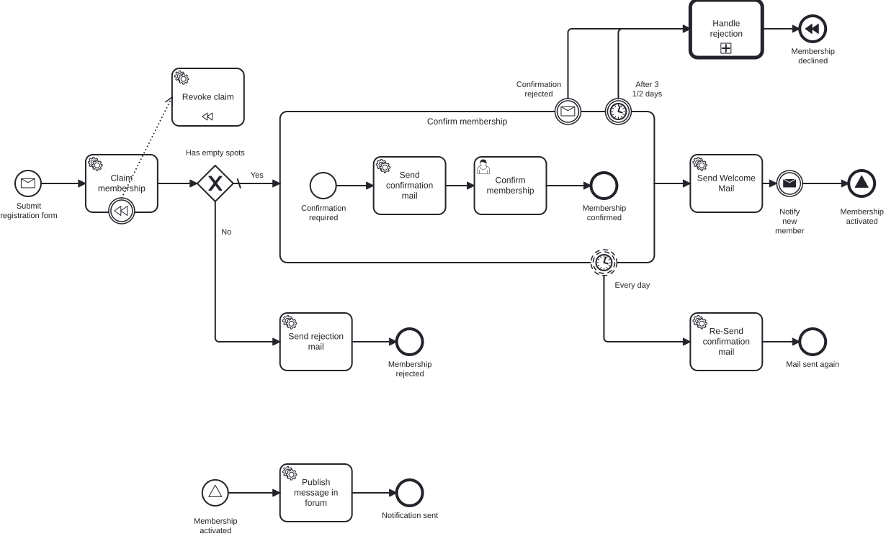
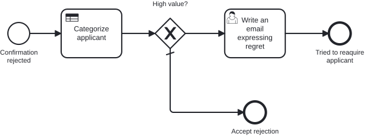

# CIB Seven Developer Training – Exercises

Willkommen zum CIB Seven Developer Training!

**Miravelo** ist ein Lifestyle-Online-Shop für Menschen in der Quarterlife-Crisis – Siebträger,
Laufausrüstung, Gravel Bikes, Rennräder. Das Unternehmen wächst, die Kundenbasis wächst,
und die Prozesse müssen mithalten.

In diesem Modul arbeitest du dich Schritt für Schritt durch 10 Aufgaben, die ein vollständiges
Newsletter- und Membership-System auf Basis von CIB Seven (Camunda Platform 7) aufbauen.

## Der vollständige Zielprozess

So sieht der Prozess am Ende von Aufgabe 10 aus – mit allen Konzepten, die du Schritt für Schritt aufbaust:



Der ausgelagerte Sub-Prozess für die Ablehnung (Call Activity + DMN):



## Voraussetzungen

```bash
# PostgreSQL und MailHog starten (im Stack-Verzeichnis)
cd ../stack && docker-compose up -d

# Anwendung starten (aus diesem exercise-Verzeichnis)
../mvnw spring-boot:run

# CIB Seven Cockpit
http://localhost:8080/camunda  (admin / admin)
```

> Im Auslieferungszustand startet dieses Modul im Zustand von **Aufgabe 1** – die
> CIB-Seven-Engine ist noch auskommentiert. In Aufgabe 1 schaltest du sie scharf.

## Aufgaben-Übersicht

| Aufgabe | Thema | Beschreibung |
|---|---|---|
| [0](docs/exercise-0.md) | Fachliche BPMN-Modellierung | Prozess rein fachlich mit Miragon BPMN Modeler erstellen |
| [1](docs/exercise-1.md) | Engine & Tooling | Lauffähigen Newsletter deployen, Cockpit & DB-Tabellen kennenlernen |
| [2](docs/exercise-2.md) | Technische Modellierung & Automatisierung | Technisch modellieren & mit Java-Code verbinden |
| [3](docs/exercise-3.md) | Bestätigungs-Mail | Service Tasks erweitern, Confirmation-Flow |
| [4](docs/exercise-4.md) | Membership & Gateway | Exclusive Gateway, Kapazitätsprüfung |
| [5](docs/exercise-5.md) | Prozess-Tests | Prozess-Unit-Test: In-Memory-Engine, gemockte Use Cases, ohne PostgreSQL |
| [5 · Add-on](docs/exercise-5-addon.md) | bpmn-to-code | Typsichere Process-API aus dem BPMN generieren – Strings raus, Konstanten rein |
| [6](docs/exercise-6.md) | Remote Engine & External Task | Message Throw Event, zweiter Prozess, External Task Worker im eigenen Service, kollaborative Members Wall |
| [7](docs/exercise-7.md) | Boundary Events | Timer- und Message-Boundary-Events, Subprozesse |
| [8](docs/exercise-8.md) | Signal Events | Signal-Events für Systemkommunikation |
| [9](docs/exercise-9.md) | Compensation | Automatisches Rollback via BPMN-Kompensation |
| [10](docs/exercise-10.md) | Call Activity & DMN | Prozess-Modularisierung mit Entscheidungstabellen |
| [Extra 1](docs/extra-task-1.md) | Process-Engine-API | Engine-Lock-in lösen: Worker statt Delegates, engine-neutraler Adapter-Layer |

## Architektur

Das Projekt folgt der **hexagonalen Architektur** (Ports & Adapters):

```
REST / CIB7 Delegates     Application              CIB7 / Database
  (inbound adapters)  →  ports + services  →     (outbound adapters)
                              ↑
                           Domain
                     (engine-neutral)
```

**Pakete unter `src/main/java/io/miragon/training/`:**

- `adapter/inbound/rest/` – Spring MVC REST-Controller
- `adapter/inbound/cibseven/` – JavaDelegate-Implementierungen (`BaseDelegate`)
- `adapter/outbound/cibseven/` – Prozess-Adapter (Prozess starten, Nachrichten korrelieren)
- `adapter/outbound/db/` – JPA-Persistenz-Adapter
- `application/port/inbound/` – Use-Case-Interfaces
- `application/port/outbound/` – Repository- und Prozess-Port-Interfaces
- `application/service/` – Use-Case-Implementierungen
- `domain/` – Reines Java Domain-Modell, keine Framework-Abhängigkeiten

## Architektur-Tests

```bash
../mvnw test -Dtest=ArchitectureTest
```

Die ArchUnit-Tests prüfen zur Testzeit, ob die Architekturregeln eingehalten werden.

## Lösungen

Für jede Aufgabe gibt es eine Referenzlösung unter `../solutions/exercise-X/`.
Jede Lösung ist eine eigenständige, lauffähige Spring Boot Anwendung.

Wenn du eine Aufgabe nicht ganz fertig bekommst, kannst du die Referenzlösung direkt in
dieses Modul kopieren und mit ihr weiterarbeiten (gültige Werte: 1–10):

```bash
../mvnw antrun:run@load-solution -Dsolution=2
```

Der Task ersetzt `src/main` komplett (Java, `application.yaml`, BPMN/DMN); `src/test` bleibt
unberührt. Alle Module laufen auf demselben Port (`8080`) und DB-Schema (`exercise`), es läuft
also immer nur ein Modul zur Zeit. Voraussetzung ist, dass du in **Aufgabe 1** die
CIB-Seven-Abhängigkeiten aktiviert hast (die `pom.xml` wird nicht mitkopiert).
