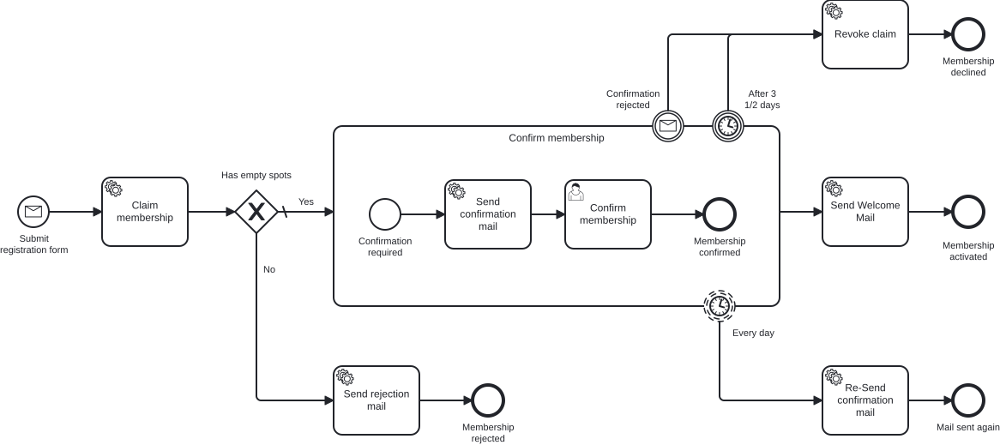

# Aufgabe 5 – Prozess-Tests

## Ziel-Modell



> Es kommt **kein neues Modell** dazu. Du testest den Prozess, den du in Aufgabe 4 gebaut hast
> (Message-Start → Claim → Gateway → Bestätigung → Welcome / Rejection).

## Lernziele

- Einen Prozess als **Unit-Test** absichern – ohne PostgreSQL, ohne laufende Infrastruktur
- Die Engine im Test auf **h2** und mit **abgeschaltetem Job-Executor** betreiben
- Die Use Cases hinter den Delegates gezielt **mocken** (`@MockitoBean`)
- Async-Continuations deterministisch bis zum nächsten **Wait State** treiben
- Prozesspfade mit **`BpmnAwareTests`** prüfen (`isWaitingAt`, `hasPassedInOrder`, `isEnded` …)

## Hintergrund

**Montagmorgen. Der Prozess läuft. Angeblich.**

Du hast in den letzten Aufgaben einen ordentlichen Prozess gebaut: Gateway, Bestätigungs-Mail,
Ablehnung. In der Cockpit-Demo hat alles funktioniert – einmal. Aber Hand aufs Herz: Woher weißt du,
dass er **immer noch** funktioniert, nachdem nächste Woche jemand ein Boundary Event dranhängt,
einen Flow umbiegt oder eine Bedingung dreht?

Klickst du dann jedes Mal von Hand durch Cockpit? Startest PostgreSQL, feuerst curl-Requests,
liest Logs? Das macht niemand zuverlässig. Und genau da sterben Prozesse leise: Ein Flow zeigt nach
dem Refactoring ins Leere, das Gateway nimmt den falschen Pfad – und keiner merkt es, bis ein
Bewerber trotz freiem Platz eine Absage bekommt.

> *„Works on my machine" ist kein Testkonzept. Es ist eine Ausrede mit besserer PR.*

Die Lösung ist ein **Prozess-Test**: Wir starten den echten Prozess in einer In-Memory-Engine,
lassen die echten Delegates laufen, mocken nur die Fachlogik dahinter – und behaupten dann in Code,
welchen Weg der Prozess nehmen muss. Ab jetzt sagt dir ein grüner Test in Sekunden, ob das Ding
noch tut, was es soll. Jede folgende Aufgabe erweitert diesen Test mit.

## Warum das ohne PostgreSQL geht

Zwei Stellschrauben machen den Test schnell und reproduzierbar:

1. **h2 statt PostgreSQL** – die Engine bekommt eine In-Memory-Datenbank, die pro Testlauf frisch
   angelegt und wieder verworfen wird (`ddl-auto: create-drop`).
2. **Job-Executor aus** – normalerweise arbeitet ein Hintergrund-Thread `asyncBefore`/`asyncAfter`
   ab. Im Test schalten wir ihn ab und treiben die Async-Continuations selbst aus dem Testthread.
   Dadurch ist das Timing komplett unter Kontrolle – kein Warten, kein Flackern.

## Aufgaben

### 1. Test-Dependency ergänzen

Die Assertions kommen aus dem CIB-Seven-Port von `camunda-bpm-assert`. Die Version ist in der
Root-`pom.xml` zentral gemanagt – im Modul reicht die Dependency ohne Version:

```xml
<dependency>
    <groupId>org.cibseven.bpm</groupId>
    <artifactId>cibseven-bpm-assert</artifactId>
    <scope>test</scope>
</dependency>
```

> `spring-boot-starter-test` (JUnit 5, Mockito, AssertJ) und `h2` sind bereits vorhanden.

### 2. Test-Profil `application-test.yaml`

**Neue Datei:** `src/test/resources/application-test.yaml`

```yaml
spring:
  main:
    allow-bean-definition-overriding: true
  datasource:
    url: jdbc:h2:mem:cibseven-test;DB_CLOSE_DELAY=-1;INIT=CREATE SCHEMA IF NOT EXISTS exercise
    username: sa
    password:
    driver-class-name: org.h2.Driver
  jpa:
    hibernate:
      ddl-auto: create-drop
    properties:
      hibernate:
        dialect: org.hibernate.dialect.H2Dialect
        default_schema: exercise

camunda:
  bpm:
    admin-user:
      id: admin
      password: admin
    database:
      type: h2
      schema-update: true
    job-execution:
      enabled: false   # <-- der Kern: Async-Continuations treiben wir selbst
    webapp:
      enabled: false

# Der Webapp-Bean validiert dieses Secret beim Start, auch wenn die Webapp aus ist:
cibseven:
  webclient:
    authentication:
      jwtSecret: M9nU3ORo3s+gK23D9mO5I2h+EIqnosCFDCJi+2bKoulKqZkeQT8pGYg5RhuORlf/fWhLu5meC/SPZCv9NNuj6SK/vE5Sid04UQGrnyh04EpBdiAosAO91xezjgmbSeALUtneibseGpS0tNE4RvLIl+gXiAKqNXyO
```

### 3. Test-Helfer anlegen

**Neue Datei:** `src/test/java/io/miragon/training/process/util/ProcessEngineTestUtils.java`

Zwei kleine Helfer reichen für diese Aufgabe (den `fireTimer`-Helfer brauchst du erst mit den
Boundary Events in Aufgabe 6):

- `continueToNextWaitState(processEngine)` – führt die offenen Async-Jobs nacheinander aus, bis der
  Prozess seinen nächsten Wait State (User Task oder Ende) erreicht.
- `findProcessInstance(runtimeService, membershipId)` – findet die laufende Instanz über den
  Process-Key `subscribeNewsletter` und die Variable `membershipId`.

```java
public static void continueToNextWaitState(ProcessEngine processEngine) {
    ManagementService ms = processEngine.getManagementService();
    for (int i = 0; i < 50; i++) {
        Job job = ms.createJobQuery().active().messages().listPage(0, 1)
                .stream().findFirst().orElse(null);
        if (job == null) return;
        ms.executeJob(job.getId());
    }
}
```

> Die vollständige Datei (inkl. `findProcessInstance` und dem `fireTimer` für später) findest du
> in der Referenzlösung.

### 4. Happy-Path-Test schreiben

**Datei:** `src/test/java/io/miragon/training/process/MembershipProcessTest.java`

Gerüst:

```java
@SpringBootTest
@ActiveProfiles("test")
class MembershipProcessTest {

    @Autowired private MembershipProcess membershipProcess;
    @Autowired private RuntimeService runtimeService;
    @Autowired private TaskService taskService;
    @Autowired private ProcessEngine processEngine;

    @MockitoBean private ClaimMembershipUseCase claimMembershipUseCase;
    @MockitoBean private SendConfirmationMailUseCase sendConfirmationMailUseCase;
    @MockitoBean private SendRejectionMailUseCase sendRejectionMailUseCase;
    @MockitoBean private SendWelcomeMailUseCase sendWelcomeMailUseCase;

    @BeforeEach
    void setUp() {
        init(processEngine); // BpmnAwareTests.init(...)
    }
}
```

Der Happy Path: `claimMembership` liefert `true`, der Prozess wartet am User Task, wir schließen ihn
ab, die Welcome-Mail wird verschickt, das Ende ist `endEvent_membershipConfirmed`.

```java
@Test
void happyPath_membershipIsConfirmedAndWelcomeMailIsSent() {
    when(claimMembershipUseCase.claimMembership(any())).thenReturn(true);

    Membership membership = new Membership(new Email("jane@example.com"), new Name("Jane"), new Age(30));
    membershipProcess.startProcess(membership);

    ProcessInstance instance = findProcessInstance(runtimeService, membership.id().value().toString());
    continueToNextWaitState(processEngine);

    assertThat(instance).isWaitingAt("userTask_confirmMembership");

    String taskId = taskService.createTaskQuery()
            .processInstanceId(instance.getProcessInstanceId()).singleResult().getId();
    taskService.complete(taskId);
    continueToNextWaitState(processEngine);

    assertThat(instance)
            .isEnded()
            .hasPassedInOrder(
                    "startEvent_submitRegistration",
                    "serviceTask_claimMembership",
                    "gateway_hasEmptySpots",
                    "serviceTask_sendConfirmationMail",
                    "userTask_confirmMembership",
                    "serviceTask_sendWelcomeMail",
                    "endEvent_membershipConfirmed")
            .hasNotPassed("serviceTask_sendRejectionMail", "endEvent_membershipRejected");

    verify(sendWelcomeMailUseCase).sendWelcomeMail(membership.id());
}
```

### 5. Rejection-Pfad testen (selbst)

Schreibe einen zweiten Test `noCapacity_membershipIsRejected`:
- `claimMembership` liefert `false`
- der Prozess läuft ohne Wait State direkt bis `endEvent_membershipRejected`
- geprüft wird: `serviceTask_sendRejectionMail` wurde durchlaufen, Bestätigung/Welcome **nicht**,
  und `sendWelcomeMailUseCase` wurde nie aufgerufen (`verify(..., never())`).

## Testen

```bash
# Nur den Prozess-Test ausführen (kein PostgreSQL nötig):
../mvnw -pl exercise test -Dtest=MembershipProcessTest
```

> **Ausblick:** Die Element-IDs stehen hier noch als Strings im Test. In der **Extra-Aufgabe**
> generierst du aus dem BPMN eine typsichere Process-API – dann werden aus `"userTask_confirmMembership"`
> geprüfte Konstanten.

## Referenzlösung

`../solutions/exercise-5/`

---

➡️ [Weiter zu Aufgabe 6](exercise-6.md)
