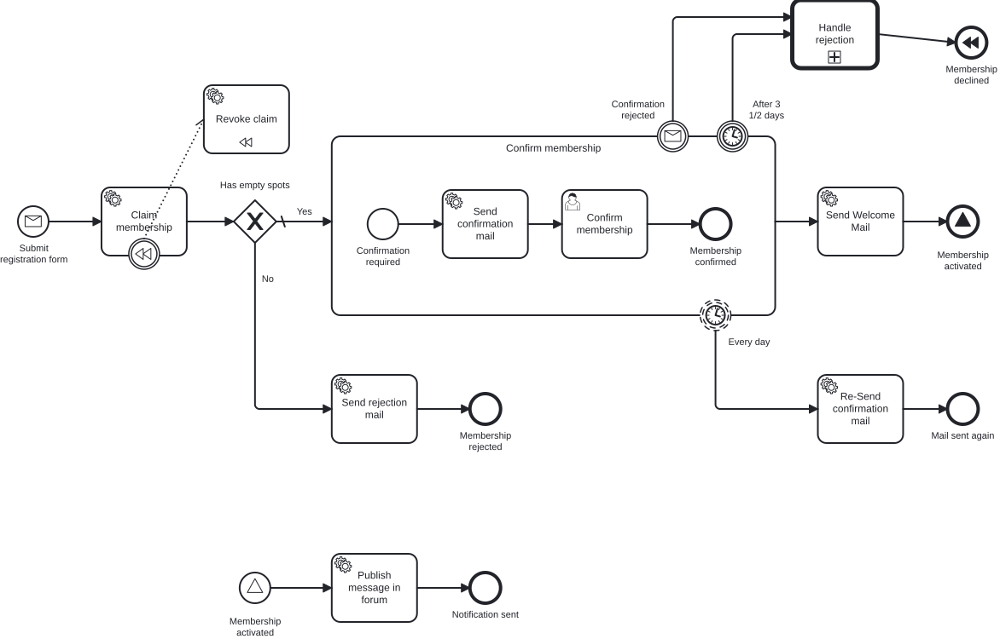

# CIB Seven Developer Training – Exercises

Willkommen zum CIB Seven Developer Training!

**Miravelo** ist ein Lifestyle-Online-Shop für Menschen in der Quarterlife-Crisis – Siebträger,
Laufausrüstung, Gravel Bikes, Rennräder. Das Unternehmen wächst, die Kundenbasis wächst,
und die Prozesse müssen mithalten.

In diesem Modul arbeitest du dich Schritt für Schritt durch 8 Aufgaben, die ein vollständiges
Newsletter- und Membership-System auf Basis von CIB Seven (Camunda Platform 7) aufbauen.

## Der vollständige Zielprozess

So sieht der Prozess am Ende von Aufgabe 8 aus – mit allen Konzepten, die du Schritt für Schritt aufbaust:



Der ausgelagerte Sub-Prozess für die Ablehnung (Call Activity + DMN):


## Voraussetzungen

```bash
# PostgreSQL und MailHog starten (im Stack-Verzeichnis)
cd ../stack && docker-compose up -d

# Anwendung starten
cd ../exercises && ../mvnw spring-boot:run

# CIB Seven Cockpit
http://localhost:8080/camunda  (admin / admin)
```

## Aufgaben-Übersicht

| Aufgabe | Thema | Beschreibung |
|---|---|---|
| [0](docs/exercise-0.md) | Fachliche BPMN-Modellierung | Prozess rein fachlich mit Miragon BPMN Modeler erstellen |
| [1](docs/exercise-1.md) | Engine & Tooling | Lauffähigen Newsletter deployen, Cockpit & DB-Tabellen kennenlernen |
| [2](docs/exercise-2.md) | Technische Modellierung & Automatisierung | Technisch modellieren & mit Java-Code verbinden |
| [3](docs/exercise-3.md) | Bestätigungs-Mail | Service Tasks erweitern, Confirmation-Flow |
| [4](docs/exercise-4.md) | Membership & Gateway | Exclusive Gateway, Kapazitätsprüfung |
| [5](docs/exercise-5.md) | Boundary Events | Timer- und Message-Boundary-Events, Subprozesse |
| [6](docs/exercise-6.md) | Signal Events | Signal-Events für Systemkommunikation |
| [7](docs/exercise-7.md) | Compensation | Automatisches Rollback via BPMN-Kompensation |
| [8](docs/exercise-8.md) | Call Activity & DMN | Prozess-Modularisierung mit Entscheidungstabellen |
| [Extra 1](docs/extra-task-1.md) | Process-Engine-API | Engine-Lock-in lösen: Worker statt Delegates, engine-neutraler Adapter-Layer |

## Architektur

Das Projekt folgt der **hexagonalen Architektur** (Ports & Adapters):

```
REST / CIB7 Delegates     Application              CIB7 / Database
  (inbound adapters)  →  ports + services  →     (outbound adapters)
                              ↑
                           Domain
                     (engine-neutral)
```

**Pakete unter `src/main/kotlin/io/miragon/training/`:**

- `adapter/inbound/rest/` – Spring MVC REST-Controller
- `adapter/inbound/cibseven/` – JavaDelegate-Implementierungen (`BaseDelegate`)
- `adapter/outbound/cibseven/` – Prozess-Adapter (Prozess starten, Nachrichten korrelieren)
- `adapter/outbound/db/` – JPA-Persistenz-Adapter
- `adapter/process/` – BPMN-Prozess-API-Konstanten
- `application/port/inbound/` – Use-Case-Interfaces
- `application/port/outbound/` – Repository- und Prozess-Port-Interfaces
- `application/service/` – Use-Case-Implementierungen
- `domain/` – Reines Kotlin Domain-Modell, keine Framework-Abhängigkeiten

## Architektur-Tests

```bash
../mvnw test -Dtest=KonsistArchitectureTest
```

Die Konsist-Tests prüfen zur Testzeit, ob die Architekturregeln eingehalten werden.

## Lösungen

Für jede Aufgabe gibt es eine Referenzlösung unter `../solutions/exercise-X/`.
Jede Lösung ist eine eigenständige, lauffähige Spring Boot Anwendung.
