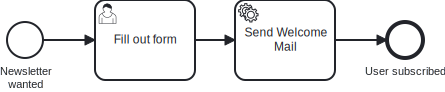

# Aufgabe 1 – Automatisierung des Prozesses

## Ziel-Modell

Das BPMN bleibt identisch zu Aufgabe 0 – diesmal verbinden wir es mit Java-Code:



## Lernziele

- Hexagonale Architektur (Ports & Adapters) verstehen
- BPMN Service Task mit Java-Code verbinden (JavaDelegate-Pattern)
- Prozess über RuntimeService starten
- REST-Endpoint zum Starten des Prozesses implementieren

## Hintergrund

Der Newsletter ist live. Seit dem Launch des neuen Gravel Bikes kommen die Sign-ups rein –
und irgendwer muss jetzt jede Anmeldung manuell im Cockpit durchklicken.

Das ist natürlich **keine** Lösung. Wir sind Entwickler. Wir automatisieren Dinge, selbst
wenn es nur ein Newsletter für Fahrrad-Enthusiasten ist.

> *„Ich klick das doch nicht 500 Mal von Hand durch."*
> — Das gesamte Team, zur Gravel-Bike-Saison

Jetzt wird der Prozess technisch automatisiert: Der Service Task `Send Welcome Mail` soll
echten Code ausführen.

Das Projekt folgt der hexagonalen Architektur:

```
POST /api/subscriptions
       ↓
SubscriptionController          (adapter/inbound/rest)
       ↓
RegisterSubscriptionUseCase     (application/port/inbound)
       ↓
RegisterSubscriptionService     (application/service)        ← TODO
       ↓
SubscriptionProcess.startProcess()  (application/port/outbound)
       ↓
SubscriptionProcessAdapter          (adapter/outbound/cibseven) ← TODO
       ↓
RuntimeService.startProcessInstanceByKey(...)
```

```
[BPMN: serviceTask_sendWelcomeMail]
       ↓
SendWelcomeMailDelegate           (adapter/inbound/cibseven) ← TODO
       ↓
SendWelcomeMailUseCase            (application/port/inbound)
       ↓
SendWelcomeMailService            (application/service)       ← TODO
```

## Aufgaben

### 1. `RegisterSubscriptionService` implementieren

**Datei:** `application/service/RegisterSubscriptionService.java`

Ersetze das `TODO` mit folgender Logik:
1. Erstelle ein `Subscription`-Objekt mit E-Mail, Name und Alter aus dem Command
2. Speichere es über das Repository
3. Starte den Prozess über den Process-Port
4. Gib die `subscription.id` zurück

### 2. `SendWelcomeMailService` implementieren

**Datei:** `application/service/SendWelcomeMailService.java`

Ersetze das `TODO` mit einem Log-Statement, das die E-Mail-Adresse der Subscription ausgibt.

### 3. `SendWelcomeMailDelegate` implementieren

**Datei:** `adapter/inbound/cibseven/SendWelcomeMailDelegate.java`

Ersetze das `TODO` in `executeTask(execution)`:
- Lies die Prozessvariable `subscriptionId` aus der `DelegateExecution`
- Rufe den UseCase `sendWelcomeMail(...)` mit der gelesenen ID auf

### 4. `SubscriptionProcessAdapter` implementieren

**Datei:** `adapter/outbound/cibseven/SubscriptionProcessAdapter.java`

Ersetze das `TODO` in `startProcess(subscription)`:
- Verwende `runtimeService.startProcessInstanceByKey(...)` mit dem Prozess-Key `subscribeNewsletter`
- Übergib die Prozessvariablen (`subscriptionId`, `email`, `name`, `age`) als Map – die Schlüssel entsprechen den Variablennamen im BPMN-Modell

## Testen

```bash
# Anwendung starten
../mvnw spring-boot:run

# Subscription registrieren
curl -X POST http://localhost:8080/api/subscriptions \
  -H "Content-Type: application/json" \
  -d '{"email": "alice@miravelo.com", "name": "Alice", "age": 28}'
```

Danach im **Cockpit** unter http://localhost:8080/camunda:
- Unter **Processes** → eine Instanz von `Subscribe Newsletter` vorhanden
- UserTask `Fill out form` erscheint in **Task List**
- Nach Abschluss der UserTask → Service Task läuft durch → Log: "Sending welcome mail to alice@miravelo.com"

## Bonus: Prozesstest

Implementiere den Test in `src/test/java/io/miragon/training/process/SubscriptionProcessTest.java`.

## Referenzlösung

`../solutions/exercise-1/`

---

➡️ [Weiter zu Aufgabe 2](exercise-2.md)
