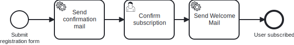

# Aufgabe 2 – Bestätigungs-Mail

## Ziel-Modell



## Lernziele

- Einen bestehenden Prozess in Camunda Modeler erweitern
- Mehrere Service Tasks implementieren
- Sequenzielle Flows mit User Tasks kombinieren

## Hintergrund

Rose hat das neue **Backroad AL** auf den Markt gebracht – und Miravelo launcht es exklusiv im Store.
Social Media dreht durch. Über Nacht: 500 Newsletter-Anmeldungen.

Das Team starrt auf die Datenbank und beginnt, Fragen zu stellen:

- Sind das echte E-Mail-Adressen?
- Wer ist überhaupt diese `noreply@throwaway.xyz`?
- Irgendwer hat `admin@miravelo.com` eingetragen. Als Witz. Wahrscheinlich.

Das Team beschließt: Wir bauen einen **Bestätigungsschritt**. Erst Mail bestätigen,
dann Welcome Mail. Klassisches Double-Opt-In.

Und während wir dabei sind – wenn schon so viele Menschen Miravelo-Produkte wollen,
vielleicht wollen sie auch mehr als nur einen Newsletter. Vielleicht wollen sie dazugehören.

> *„500 Sign-ups. Das ist entweder viral oder ein Bot-Angriff."*
> — CTO, beim zweiten Kaffee

### Neuer Prozessablauf

```
[Newsletter wanted]
        ↓
[Send confirmation mail]   ← NEU (Service Task)
        ↓
[Confirm subscription]     ← NEU (User Task)
        ↓
[Send Welcome Mail]
        ↓
[User subscribed]
```

## Aufgaben

### 1. BPMN erweitern

Öffne `src/main/resources/bpmn/newsletter.bpmn` im Camunda Modeler und erweitere den Prozess:

| Element | Typ | ID | Name | Konfiguration |
|---|---|---|---|---|
| Bestätigungs-Mail | Service Task | `serviceTask_sendConfirmationMail` | Send confirmation mail | Delegate Expression: `#{sendConfirmationMailDelegate}` |
| Bestätigung | User Task | `userTask_confirmSubscription` | Confirm subscription | – |

**Achtung:** Der Service Task `sendConfirmationMail` muss **vor** dem User Task stehen.

Referenz-Modell: `../models/task-2-with-confirmation.bpmn`

## Best Practice: Async Continuations

Setze in deinem Modell mindestens:
- `asyncBefore` am **Message-Start-Event** `startEvent_submitRegistration`
- `asyncAfter` an jedem **User Task** (also an `userTask_confirmSubscription`)

Hintergrund: Damit wird nach jedem Wait-State eine neue Engine-Transaktion gestartet. Fehler in nachgelagerten Service Tasks führen sonst dazu, dass die User-Task-Completion zurückgerollt wird und der Task im Tasklist wieder erscheint. `asyncBefore` am Message-Start gibt der Engine eine saubere TX-Grenze nach der Message-Korrelation.

Im Camunda Modeler: Element selektieren → Properties Panel → "Asynchronous Before/After".

### 2. `SendConfirmationMailUseCase` erstellen

**Neue Datei:** `application/port/inbound/SendConfirmationMailUseCase.java`

Erstelle ein Interface mit einer Methode `sendConfirmationMail(SubscriptionId)`.

### 3. `SendConfirmationMailService` implementieren

**Neue Datei:** `application/service/SendConfirmationMailService.java`

Lade die Subscription über das Repository und logge die E-Mail-Adresse, an die die Bestätigungsmail gesendet wird.

### 4. `SendConfirmationMailDelegate` erstellen

**Neue Datei:** `adapter/inbound/cibseven/SendConfirmationMailDelegate.java`

Orientiere dich an `SendWelcomeMailDelegate`. Der Delegate soll:
- `subscriptionId` aus der `DelegateExecution` lesen
- `useCase.sendConfirmationMail(...)` aufrufen

## Testen

```bash
curl -X POST http://localhost:8080/api/subscriptions \
  -H "Content-Type: application/json" \
  -d '{"email": "bob@miravelo.com", "name": "Bob", "age": 25}'
```

Im Cockpit:
1. Service Task `Send confirmation mail` läuft durch → Log: "Sending confirmation mail to bob@miravelo.com"
2. UserTask `Confirm subscription` erscheint in der Task List
3. Nach Abschluss → Service Task `Send Welcome Mail` läuft durch

## Referenzlösung

`../solutions/exercise-2/`

---

➡️ [Weiter zu Aufgabe 3](exercise-3.md)
