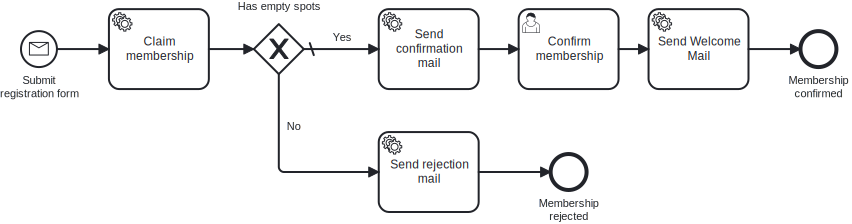

# Aufgabe 3 – Membership & Kapazitätsprüfung

## Ziel-Modell



## Lernziele

- Domain-Konzepte umbenennen (Refactoring)
- Exclusive Gateway modellieren und implementieren
- Neuen Service Task (Kapazitätsprüfung) hinzufügen
- Alternativen Prozessausgang implementieren

## Hintergrund

**Strategie-Meeting. Freitagnachmittag. Jemand hat exklusiven Matcha Latte mitgebracht.**

Miravelo startet den **Miravelo Inner Circle** – eine limitierte, exklusive Membership
für echte Fans der Marke. Gravel Bike im Keller, Rennrad an der Wand – du weißt, wen wir meinen.

Tausend Plätze. Zählt bis tausend. Das ist die Kapazität.

Warum tausend? Weil Knappheit Wert erzeugt. Weil FOMO ein Business-Modell ist. Weil irgendjemand
ein Buch über Luxusmarken gelesen hat und jetzt „Premium Positioning" in jeden Satz einbaut.

> *„Wir sind nicht exklusiv weil wir gut sind. Wir sind exklusiv weil wir nur tausend Plätze
> haben und der Counter in der Datenbank auf 1000 steht."*
> — Ehrlichster Kommentar im Sprint Planning

Das Gute daran: Aus Prozesssicht brauchen wir ein **Gateway**. Der gnadenlose Türsteher im
Prozessfluss. Hat die Person einen Platz bekommen? Herzlichen Glückwunsch, weiter. Kein Platz?
Ablehnungsmail. Kein Einspruch. Das Gateway entscheidet.

Mit 27 eine Absage vom Fahrradladen des Vertrauens zu bekommen trifft anders. Aber das ist
jetzt das Problem der Bewerber, nicht deins.

> **Hinweis:** In dieser Aufgabe findet ein Domain-Refactoring statt. Bisher war die Domäne
> eine einfache Newsletter-Subscription. Ab jetzt wird daraus eine **Membership** im
> Miravelo Inner Circle. Benenne die bestehenden Klassen entsprechend um
> (z.B. `Subscription` → `Membership`, `SubscriptionId` → `MembershipId`, etc.).

### Neuer Prozessablauf

```
[Submit registration form]
         ↓
[Claim membership]         ← NEU (Service Task)
         ↓
[Has empty spots?]         ← NEU (Exclusive Gateway)
   ↓ Yes              ↓ No
[Send confirmation]   [Send rejection mail]  ← NEU
         ↓                    ↓
[Confirm membership]  [Membership rejected]  ← NEU End Event
         ↓
[Send Welcome Mail]
         ↓
[Membership confirmed]
```

## Aufgaben

### 1. BPMN komplett neu modellieren

Erstelle den Prozess nach dem Referenz-Modell `../models/task-3-gateway.bpmn`.

Neue Elemente:

| Element | Typ | ID | Name | Konfiguration |
|---|---|---|---|---|
| Claim | Service Task | `serviceTask_claimMembership` | Claim membership | `#{claimMembershipDelegate}` |
| Gateway | Exclusive Gateway | `gateway_hasEmptySpots` | Has empty spots? | Default-Flow: `Yes`-Pfad |
| Rejection Mail | Service Task | `serviceTask_sendRejectionMail` | Send rejection mail | `#{sendRejectionMailDelegate}` |
| Abgelehnt | End Event | `endEvent_membershipRejected` | Membership rejected | – |

**Gateway-Bedingung (Nein-Pfad):** `${!hasEmptySpots}`

### 2. Domain erweitern: `MembershipCapacity`

**Neue Datei:** `domain/MembershipCapacity.java`

Erstelle eine Klasse `MembershipCapacity` mit folgenden Eigenschaften:
- `maxSpots` (int, Default: 1000) – maximale Anzahl verfügbarer Plätze
- `claimedSpots` (int, Default: 0) – aktuell belegte Plätze
- `hasEmptySpots` – gibt `true` zurück, wenn `claimedSpots < maxSpots`
- `claim()` – erhöht `claimedSpots` um 1

### 3. Use Cases und Services erstellen

Erstelle nach dem bewährten Muster (analog zu Aufgabe 2):

- `ClaimMembershipUseCase` / `ClaimMembershipService`
  - Prüft Kapazität (einfacher Counter in Memory reicht)
  - Setzt Prozessvariable `hasEmptySpots` (via `DelegateExecution.setVariable(...)`)
- `SendRejectionMailUseCase` / `SendRejectionMailService`
  - Loggt "Sending rejection mail to [email]"

### 4. Delegates erstellen

- `ClaimMembershipDelegate`: Prüft Kapazität, setzt Variable `hasEmptySpots` auf der `DelegateExecution`
- `SendRejectionMailDelegate`: Liest `membershipId`, ruft Use Case auf

**Hinweis:** Die Element-IDs und Variablennamen (z.B. `hasEmptySpots`) kannst du direkt aus dem BPMN-Modell entnehmen.

## Best Practice: Async Continuations

Setze in deinem Modell mindestens:
- `asyncBefore` am **Message-Start-Event** `startEvent_submitRegistration`
- `asyncAfter` an jedem **User Task** (also an `userTask_confirmMembership`)

Hintergrund: Damit wird nach jedem Wait-State eine neue Engine-Transaktion gestartet. Fehler in nachgelagerten Service Tasks führen sonst dazu, dass die User-Task-Completion zurückgerollt wird und der Task im Tasklist wieder erscheint. `asyncBefore` am Message-Start gibt der Engine eine saubere TX-Grenze nach der Message-Korrelation.

Im Camunda Modeler: Element selektieren → Properties Panel → "Asynchronous Before/After".

## Testen

**Happy Path (Kapazität vorhanden):**
```bash
curl -X POST http://localhost:8080/api/memberships \
  -d '{"email": "carol@miravelo.com", "name": "Carol", "age": 27}'
```

**Rejection Path (Kapazität auf 0 setzen → Anwendungs-Config anpassen):**
```bash
# Setze maxSpots = 0 in der Konfiguration
curl -X POST http://localhost:8080/api/memberships \
  -d '{"email": "dave@miravelo.com", "name": "Dave", "age": 30}'
# Erwartetes Log: "Sending rejection mail to dave@miravelo.com"
```

## Referenzlösung

`../solutions/exercise-3/`

---

➡️ [Weiter zu Aufgabe 4](exercise-4.md)
