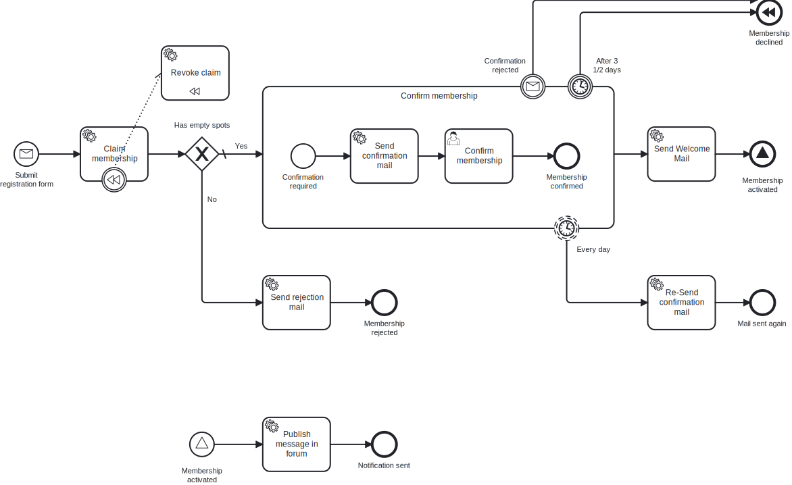

# Aufgabe 6 – Kompensation (SAGA-Muster)

## Ziel-Modell



## Lernziel

Du lernst das BPMN-Kompensationsmuster kennen: Wie man bereits abgeschlossene Aktionen bei einem Fehler oder Abbruch automatisch rückgängig macht, ohne explizite Rollback-Logik in den Sequenzfluss einzubauen.

## Hintergrund

Erinnerst du dich an `revokeClaim`? In Aufgabe 4 haben wir den Service Task eingeführt, um den Membership-Platz bei Ablehnung oder Timeout wieder freizugeben – als expliziter Knoten direkt im Sequenzfluss. Damals: pragmatisch. Heute: nicht mehr zeitgemäß.

Statt den `revokeClaim` weiterhin als expliziten Service Task an jeden Decline-Pfad zu hängen, nutzen wir **BPMN-Kompensation**. Der Prozess deklariert einmal, *welche Aktion* (`revokeClaim`) *welche andere Aktion* (`claimMembership`) rückgängig macht. Sobald ein Compensating End Event erreicht wird, kümmert sich die Engine um den Rest.

**Warum ist das besser?** Bei mehreren abzusichernden Aktionen (z.B. claimMembership + sendConfirmationMail + Drittdienste) wächst der manuelle Kompensierungspfad schnell und wird schwer wartbar. Mit BPMN-Kompensation deklariert man die Zuordnung einmal – und die Engine übernimmt die Ausführung automatisch.

```
serviceTask_claimMembership ──── [Kompensations-Boundary] ──── serviceTask_revokeClaim
                                                                (isForCompensation=true)
endEvent_membershipDeclined  →  [Compensating End Event]  →  Engine ruft revokeClaim auf
```

## Best Practice: Async Continuations

Setze in deinem Modell mindestens:
- `asyncAfter` an jedem **User Task** und **Message Event** (Boundary, Catch, Receive)
- `asyncBefore` am Message-/Signal-Start-Event

Hintergrund: Damit wird nach jedem Wait-State eine neue Engine-Transaktion gestartet. Fehler in nachgelagerten Service Tasks führen sonst dazu, dass die User-Task-Completion zurückgerollt wird und der Task im Tasklist wieder erscheint.

Im Camunda Modeler: Element selektieren → Properties Panel → "Asynchronous After".

## BPMN-Änderungen

### Hauptprozess (`newsletter.bpmn`)

1. **Kompensations-Boundary Event** an `serviceTask_claimMembership` anhängen
   - Typ: Compensation Boundary Event
   - Mit Association verbinden zu: `serviceTask_revokeClaim`

2. **`serviceTask_revokeClaim` als Compensation Handler markieren**
   - `isForCompensation="true"` setzen
   - Task liegt **nicht** auf einem Sequenzfluss (kein Incoming/Outgoing)

3. **Decline-Pfade vereinfachen**
   - Vorher: `timer_abortAfter3HalfDays` / `event_confirmationRejected` → `serviceTask_revokeClaim` → `endEvent_membershipDeclined`
   - **Nachher:** Beide Boundary Events gehen direkt auf `endEvent_membershipDeclined`
   - `revokeClaim` aus dem Pfad entfernen (die Kompensation übernimmt es)

4. **`endEvent_membershipDeclined` in Compensating End Event umwandeln**
   - Typ: Compensating End Event (der „Ring mit Pfeil"-Marker)
   - Beide Decline-Pfade münden in dieses Event

Referenz-Modell: `../models/task-6-compensation.bpmn`

## Aufgaben

### 1. BPMN modellieren

Ändere `newsletter.bpmn` im Camunda Modeler:

- [ ] Compensation Boundary Event an `serviceTask_claimMembership` anhängen
- [ ] `serviceTask_revokeClaim` mit `isForCompensation=true` markieren und per Association mit dem Boundary verknüpfen
- [ ] Decline-Pfade direkt mit `endEvent_membershipDeclined` verbinden (kein `revokeClaim` im Pfad)
- [ ] `endEvent_membershipDeclined` in Compensating End Event umwandeln
- [ ] `asyncAfter` an `userTask_confirmMembership` und allen Message-/Boundary-Events setzen (siehe Best-Practice-Kasten)

### 2. Code anpassen

Der `RevokeClaimDelegate` bleibt unverändert – er wird jetzt nur anders aufgerufen (durch die BPMN-Engine statt via Sequenzfluss). Es muss kein Java-Code geändert werden.

**Kontrollfrage:** Warum funktioniert `RevokeClaimDelegate` ohne Änderungen weiter, obwohl er nicht mehr im Sequenzfluss liegt?

### 3. Verhalten testen

**Szenario A – Timer-Ablauf:**
1. `POST /api/memberships` → Prozess startet, Claim wird gesetzt
2. Warte bis Timer-Boundary ausgelöst wird (z.B. Timer-Konfiguration auf 30s für den Test setzen)
3. Überprüfe im Log: `revokeClaim` wurde aufgerufen (obwohl kein expliziter Service Task im Pfad)
4. Cockpit: Prozessinstanz endet mit „Membership declined"

**Szenario B – Manuelle Ablehnung via Confirmation-Rejection-Message:**
1. `POST /api/memberships` → warte auf UserTask `confirmMembership`
2. Trigger Confirmation-Rejected-Message → `event_confirmationRejected` Boundary löst aus
3. Pfad geht direkt zu `endEvent_membershipDeclined` → Compensation feuert → `revokeClaim` automatisch ausgeführt

## Kontrolle

- [ ] Log zeigt `"Revoking membership claim"` beim Timer-Ablauf (ohne expliziten Task im Pfad)
- [ ] Log zeigt `"Revoking membership claim"` nach Ablehnung via Message
- [ ] Cockpit: Kompensations-Handler wird in der Prozesshistorie sichtbar
- [ ] `revokeClaim` ist **nirgendwo** mehr im Sequenzfluss – nur noch als Compensation Handler

## Referenzlösung

`../solutions/exercise-6/`

## Weiterführendes

- BPMN-Kompensation eignet sich besonders für **SAGA-Muster** in Microservices: Jeder Schritt hat einen zugehörigen Kompensationsschritt. Bei Fehlern kompensiert die Engine alle bisher erfolgreichen Schritte in umgekehrter Reihenfolge.
- In CIB Seven kann Kompensation auch über Subprocess-Grenzen hinweg ausgelöst werden.

---

➡️ [Weiter zu Aufgabe 7](exercise-7.md)
