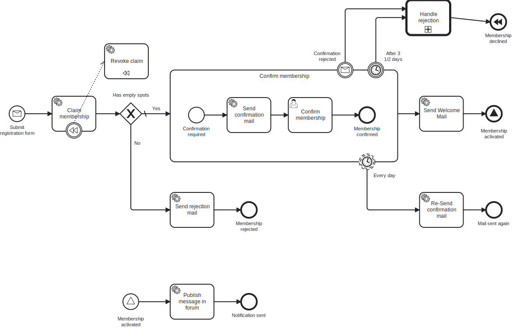
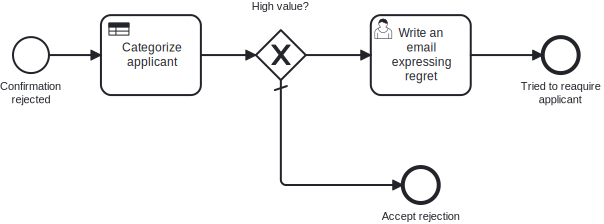

# Aufgabe 7 – Call Activity & DMN

> **Voraussetzung:** Aufgabe 6 (Kompensation) ist abgeschlossen. Der Hauptprozess kennt bereits die Compensation-Boundary auf `serviceTask_claimMembership`.

## Ziel-Modell

Hauptprozess:



Sub-Prozess `handleRejection`:



## Lernziele

- Call Activities modellieren und einsetzen
- Subprozesse in eigenständige Prozesse auslagern
- Datenaustausch zwischen Haupt- und Subprozess (Variable Mappings)
- DMN-Entscheidungstabellen modellieren und einbinden
- Business Rule Tasks in BPMN verwenden
- User Tasks für manuelle Eingriffe basierend auf DMN-Ergebnissen

## Hintergrund

Nach Aufgabe 6 läuft die Kompensation sauber: Wird ein Membership abgelehnt, kümmert sich die Engine via `serviceTask_revokeClaim`. Aber das ist erst der Anfang.

Miravelo hat eine wichtige Erkenntnis gewonnen: Einige dieser „Crisis-Aspiranten" im Alter von 21–30 sind viel zu wertvoll, um sie einfach ziehen zu lassen. Die verdienen gut, sind mitten in ihrer Quarterlife Crisis und suchen genau das, was Miravelo bietet. Die müssen wir nochmal kontaktieren!

Um den Hauptprozess nicht aufzublähen, lagern wir die gesamte Rejection-Behandlung in einen eigenen Prozess aus und rufen ihn über eine **Call Activity** auf. Die Compensation-Logik aus Aufgabe 6 bleibt im Hauptprozess – die Call Activity steht zwischen den Decline-Boundary-Events und dem Compensating End Event.

> In diesem Fall könnte man das auch in einem Embedded Subprocess lösen – aber wir wollen verschiedene BPMN-Elemente kennenlernen ;)

Nachdem die Call Activity steht, kommt der nächste Schritt: Wir wollen automatisch erkennen, welche abgelehnten Bewerber besonders wertvoll sind. Die „Quarterlife-Crisis"-Zielgruppe (21–29 Jahre) soll per **DMN-Entscheidungstabelle** identifiziert werden. Wenn jemand als „high value" eingestuft wird, soll ein Mitarbeiter persönlich Kontakt aufnehmen – per **User Task**.

### Prozessstruktur

```
Hauptprozess (newsletter.bpmn):
  ...
  [boundary_timer | event_confirmationRejected]
        ↓
  [CallActivity: handleRejection]
        ↓
  [Compensating End Event: Membership declined]
        ↓ (Engine löst Compensation aus)
  [serviceTask_revokeClaim]

Subprozess (membership-rejection.bpmn):
  [Start] → [Categorize applicant (DMN)] → [Is high value?]
                                                ↓ Yes              ↓ No
                                          [Contact personally]  [End: accepted]
                                           (User Task)
                                                ↓
                                          [End: tried to reaquire]
```

## Best Practice: Async Continuations

Setze in deinem Modell mindestens:
- `asyncAfter` an jedem **User Task** und **Message Event** (Boundary, Catch, Receive)
- `asyncBefore` am Message-/Signal-Start-Event

Hintergrund: Damit wird nach jedem Wait-State eine neue Engine-Transaktion gestartet. Fehler in nachgelagerten Service Tasks führen sonst dazu, dass die User-Task-Completion zurückgerollt wird und der Task im Tasklist wieder erscheint.

Im Camunda Modeler: Element selektieren → Properties Panel → "Asynchronous After".

## Aufgaben

### 1. Subprozess `membership-rejection.bpmn` erstellen

Neue Datei: `src/main/resources/bpmn/membership-rejection.bpmn`

Referenz: `../models/task-7-call-activity-sub.bpmn`

Struktur:
- Process ID: `handleRejection`
- Start Event → Business Rule Task `Categorize applicant` → Exclusive Gateway → User Task `Contact personally` (Yes-Pfad) → End Event "Tried to reacquire"
- Default-Pfad (No): direkt → End Event "Accept rejection"

### 2. Hauptprozess anpassen

Ersetze die direkten Decline-Pfade aus Aufgabe 6 durch eine **Call Activity**:

| Element | Typ | ID | Name | Konfiguration |
|---|---|---|---|---|
| Rejection-Handler | Call Activity | `callActivity_handleRejection` | Handle rejection | Called Element: `handleRejection` |

- Eingehende Flows: `timer_abortAfter3HalfDays`, `event_confirmationRejected` Boundary
- Ausgehender Flow: → `endEvent_membershipDeclined` (Compensating End Event aus Aufgabe 6)

Die Compensation aus Aufgabe 6 bleibt unangetastet. Nach Rückkehr aus der Call Activity feuert das Compensating End Event und die Engine ruft `serviceTask_revokeClaim` auf.

Referenz: `../models/task-7-call-activity-main.bpmn`

### 3. Variablen-Übergabe konfigurieren

In der Call Activity müssen Variablen übergeben werden:

**In-Mapping (Hauptprozess → Subprozess):**
- `membershipId` → `membershipId`
- `age` → `age` (wird für die DMN-Entscheidung benötigt)

**Out-Mapping (Subprozess → Hauptprozess):** (optional, falls Ergebnis zurückgegeben werden soll)

### 4. DMN-Entscheidungstabelle einbinden

Kopiere die Referenz-DMN ins Projekt:

```bash
cp ../models/categorize-applicant.dmn src/main/resources/dmn/categorize-applicant.dmn
```

Inhalt der DMN-Tabelle:
- **Decision ID:** `categorizeApplicant`
- **Input:** `age` (Integer)
- **Output:** `isHighValue` (Boolean)
- **Regel:** Alter zwischen 21 und 29 → `true` (Quarter-Life-Crisis!), sonst `false`

### 5. Business Rule Task im Subprozess konfigurieren

| Element | Typ | ID | Name | Konfiguration |
|---|---|---|---|---|
| Kategorisierung | Business Rule Task | `businessRuleTask_categorizeApplicant` | Categorize applicant | Decision Ref: `categorizeApplicant`, Result Variable: `isHighValue`, Map Decision Result: `singleEntry` |
| VIP-Check | Exclusive Gateway | `gateway_highValue` | High value? | Default-Flow: No-Pfad |
| Persönlicher Kontakt | User Task | `userTask_writeRegretMail` | Write an email expressing regret | `asyncAfter=true` |

Gateway-Bedingungen:
- Yes-Pfad: `${isHighValue}`
- No-Pfad: Default

## Testen

**Call Activity prüfen (einfache Ablehnung, Alter außerhalb 21–29):**
```bash
MEMBERSHIP_ID=$(curl -s -X POST http://localhost:8080/api/memberships \
  -d '{"email": "grace@miravelo.com", "name": "Grace", "age": 35}' | jq -r .id)

# Confirmation-Rejected-Message triggern
curl -X POST http://localhost:8080/api/memberships/$MEMBERSHIP_ID/reject
```

Im Cockpit:
1. Hauptprozess hat eine Call Activity-Aufrufstelle
2. Separate Instanz von `handleRejection` läuft kurz durch
3. DMN evaluiert → `isHighValue = false` → direkt zu „Accept rejection" End Event
4. Rückkehr in Hauptprozess → Compensating End Event → Log: „Revoking claim for [membershipId]"

**VIP-Bewerber (Alter 21–29):**
```bash
MEMBERSHIP_ID=$(curl -s -X POST http://localhost:8080/api/memberships \
  -d '{"email": "hanna@miravelo.com", "name": "Hanna", "age": 25}' | jq -r .id)

curl -X POST http://localhost:8080/api/memberships/$MEMBERSHIP_ID/reject
```

Im Cockpit:
1. Im `handleRejection`-Subprozess → DMN → `isHighValue = true`
2. **User Task „Write email expressing regret"** erscheint in der Task List
3. Mitarbeiter füllt Notiz aus und schließt Task ab
4. Sub-Prozess endet → Hauptprozess → Compensation triggert `revokeClaim`

## Kontrolle

- [ ] Sub-Prozess `handleRejection` ist als eigene Datei modelliert und im Cockpit als separate Process Definition deployed
- [ ] Call Activity übergibt `membershipId` und `age` per In-Mapping
- [ ] DMN-Tabelle ist in `src/main/resources/dmn/` und wird beim Deployment registriert
- [ ] Bei Alter 21–29: User Task erscheint; bei anderem Alter: direkt zum End Event
- [ ] Nach Sub-Prozess-Rückkehr: Compensation aus Aufgabe 6 löst `revokeClaim` aus

## Referenzlösung

`../solutions/exercise-7/`

---

🎉 **Glückwunsch!** Du hast alle Aufgaben durchgearbeitet und einen vollständigen, produktionsreifen Prozess mit Service Tasks, User Tasks, Gateways, Boundary Events, Sub-Prozessen, Signal Events, Kompensation, Call Activity und DMN aufgebaut.
